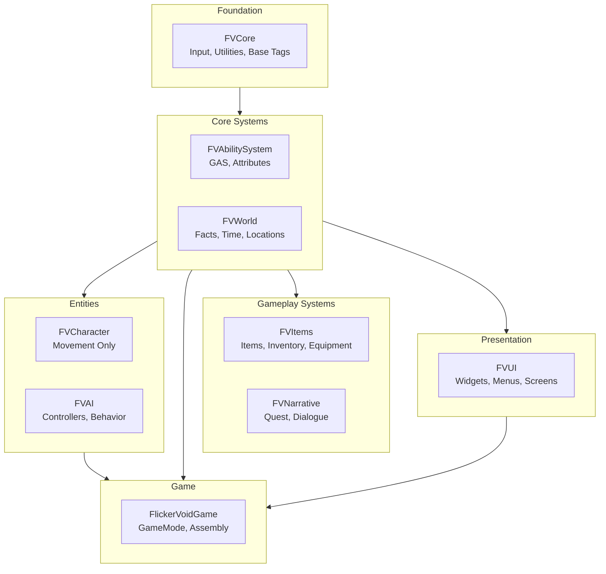

# Unreal Engine 5 Module Architecture Best Practices

## Your Questions Answered

### 1. Do I Need FVStateSystem?

**Short Answer**: No, but you might want a lightweight "Facts Subsystem".

Unreal provides:
- **Gameplay Tags** - Perfect for boolean state flags
- **Gameplay Attributes (GAS)** - For numeric values
- **State Trees (UE 5.3+)** - Visual state machine editor
- **Behavior Trees** - For AI decision making
- **GameInstanceSubsystem** - For persistent game state

What CDPR's Facts Database does that UE doesn't have built-in:
- Queryable key-value store that persists across levels
- Simple API: `SetFact("MetBarkeeper", true)` / `GetFact("MetBarkeeper")`

**Recommendation**: Create a simple `UFVFactsSubsystem` as a GameInstanceSubsystem - it's just a TMap wrapper, not a state machine.
This is all you need - not a full module, just one class 
```cpp
UCLASS() 
class UFVFactsSubsystem : public UGameInstanceSubsystem 
{ 
	GENERATED_BODY() 
public: 
	UFUNCTION(BlueprintCallable) 
	void SetFact(FName FactName, int32 Value);
	UFUNCTION(BlueprintCallable, BlueprintPure)
	int32 GetFact(FName FactName) const;

	UFUNCTION(BlueprintCallable, BlueprintPure)
	bool HasFact(FName FactName) const;
private: 
	UPROPERTY() 
	TMap<FName, int32> Facts; 
};
```
Put this in **FVWorld** module - no separate module needed.

---

### 2. Do I Need Separate FVGameplayTags Module?

**Short Answer**: No, you don't.

A separate module would contain:
- One header file with `UE_DECLARE_GAMEPLAY_TAG_EXTERN` macros
- One cpp file with `UE_DEFINE_GAMEPLAY_TAG` definitions

**Better Approach for Your Project**:

Put tags in the module that "owns" them:

| Tags | Module | Namespace |
|------|--------|-----------|
| Input tags, InitState tags | FVCore | `FVCoreTags` |
| Ability/Effect tags | FVGameplay | `FVGameplayTags` |
| Quest/Dialogue/Memory/Sanity tags | FVNarrative | `FVNarrativeTags` |
| Item/Interaction/Interactable tags | FVItems | `FVItemsTags` |
| AI/Behavior/Attack/Response tags | FVAI | `FVAITags` |
| Character Status/Movement/Mood/Trait tags | FVCharacter | `FVCharacterTags` |
| World/Location tags | FVWorld | `FVWorldTags` |
| UI-specific tags | FVUI | `FVUITags` |

**The Unreal Way**: Define tags in the module that uses them most. Use `GameplayTags.ini` or Data Assets for designer-created tags.

#### Gameplay Tag File Structure

Each module has a tag file pair in its Public/Private folders:

```text
Source/
├── FVCore/
│   ├── Public/FVCoreTags.h          // FVCoreTags namespace
│   └── Private/FVCoreTags.cpp
├── FVGameplay/
│   ├── Public/FVGameplayTags.h      // FVGameplayTags namespace
│   └── Private/FVGameplayTags.cpp
├── FVCharacter/
│   ├── Public/FVCharacterTags.h     // FVCharacterTags namespace
│   └── Private/FVCharacterTags.cpp
├── FVAI/
│   ├── Public/FVAITags.h            // FVAITags namespace
│   └── Private/FVAITags.cpp
├── FVItems/
│   ├── Public/FVItemsTags.h         // FVItemsTags namespace
│   └── Private/FVItemsTags.cpp
├── FVNarrative/
│   ├── Public/FVNarrativeTags.h     // FVNarrativeTags namespace
│   └── Private/FVNarrativeTags.cpp
├── FVWorld/
│   ├── Public/FVWorldTags.h         // FVWorldTags namespace
│   └── Private/FVWorldTags.cpp
└── FVUI/
    ├── Public/FVUITags.h            // FVUITags namespace
    └── Private/FVUITags.cpp
```

#### Tag File Pattern

**Header (FV{Module}Tags.h):**
```cpp
#pragma once

#include "NativeGameplayTags.h"

#define UE_API FLICKERVOID{MODULE}_API

namespace FV{Module}Tags
{
    UE_API UE_DECLARE_GAMEPLAY_TAG_EXTERN(TagCategory_TagName);
    // ... more tags
}

#undef UE_API
```

**Implementation (FV{Module}Tags.cpp):**
```cpp
#include "FV{Module}Tags.h"

namespace FV{Module}Tags
{
    UE_DEFINE_GAMEPLAY_TAG_COMMENT(TagCategory_TagName, "TagCategory.TagName", "Description of the tag.");
    // ... more definitions
}
```

#### Using Tags from Other Modules

When using tags from another module, include that module's tag header and use its namespace:

```cpp
#include "FVCharacterTags.h"  // From FVCharacter module
#include "FVAITags.h"         // From FVAI module

void UMyComponent::DoSomething()
{
    // Use the appropriate namespace
    if (StateTag.MatchesTag(FVAITags::Character_State_Hostile))
    {
        // Handle hostile state
    }

    if (CharacterTag.MatchesTag(FVCharacterTags::Status_Death))
    {
        // Handle death
    }
}
```

---

### 3. Can Modules Be in Subfolders (Layers)?

**Yes, but it's unconventional.**

**Issues with subfolders**:
- Need to update `.uproject` module paths
- Build scripts may need adjustment
- Goes against UE conventions

**Just document the layers** - the dependency graph IS your layer system.

---

### 4. Naughty Dog's Encounter System Explained

The **Encounter System** is a self-contained gameplay segment that manages:
```text
┌─────────────────────────────────────────────────────────────┐ 
│                      ENCOUNTER                              │
├─────────────────────────────────────────────────────────────┤
│  Trigger Volume                                             │
│  ├── Entry Conditions (player enters, quest state, etc.)    │
│  └── Exit Conditions (all enemies dead, player leaves)      │
├─────────────────────────────────────────────────────────────┤
│  Spawn Points                                               │
│  ├── Initial spawns (enemies present when entering)         │
│  ├── Wave spawns (reinforcements)                           │
│  └── Spawn rules (max active, cooldowns)                    │
├─────────────────────────────────────────────────────────────┤
│  AI Context                                                 │
│  ├── Cover points available to this encounter               │
│  ├── Patrol routes                                          │
│  └── Alert/Search areas                                     │
├─────────────────────────────────────────────────────────────┤
│  State                                                      │
│  ├── Idle (not triggered)                                   │
│  ├── Active (in combat)                                     │
│  ├── Alerted (searching)                                    │
│  └── Completed (resolved)                                   │
├─────────────────────────────────────────────────────────────┤
│  Rewards/Consequences                                       │
│  ├── Loot drops                                             │
│  └── World state changes                                    │
└─────────────────────────────────────────────────────────────┘
```

**For FlickerVoid (narrative focus, not combat)**, an Encounter would be:

```text
┌─────────────────────────────────────────────────────────────┐
│              NARRATIVE ENCOUNTER (FV Style)                 │
├─────────────────────────────────────────────────────────────┤
│  Location: The Bar                                          │
├─────────────────────────────────────────────────────────────┤
│  Active NPCs                                                │
│  ├── Barkeeper (always present during open hours)           │
│  ├── Regular patrons (spawn based on time)                  │
│  └── Quest NPCs (spawn based on quest state)                │
├─────────────────────────────────────────────────────────────┤
│  Available Interactions                                     │
│  ├── Order drink (affects Addiction)                        │
│  ├── Talk to Barkeeper (DialogueSignal: Bar_Greeting)       │
│  └── Eavesdrop on patrons (unlocks rumors)                  │
├─────────────────────────────────────────────────────────────┤
│  State Conditions                                           │
│  ├── Time: 18:00 - 02:00 (bar open hours)                   │
│  ├── Sanity > 0.2 (can't enter if too unstable)             │
│  └── Not banned (WorldState.BannedFromBar = false)          │
├─────────────────────────────────────────────────────────────┤
│  Ambient Behavior                                           │
│  ├── Patrons chat, drink, move around                       │
│  ├── Music plays                                            │
│  └── Barkeeper wipes glasses when idle                      │
└─────────────────────────────────────────────────────────────┘
```

**In UE5 Terms**: This would be a `ALevelInstance` or `AVolume` with an `UFVEncounterComponent` that manages the local state.

---

## Revised Architecture for Unreal Way

### Simplified Module Structure



### What Goes Where

| Module | Contains | Blueprint Exposure |
|--------|----------|-------------------|
| **FVCore** | Input config, Physical materials, Math helpers, Base interfaces | Minimal - mostly C++ building blocks |
| **FVAbilitySystem** | ASC, AttributeSets, GameplayAbilities, GameplayEffects | Heavy - designers create abilities/effects in BP |
| **FVWorld** | FactsSubsystem, TimeSubsystem, LocationManager, EncounterBase | Medium - designers configure encounters in BP |
| **FVItems** | ItemDefinitions, InventoryComponent, EquipmentComponent | Heavy - designers create items as Data Assets |
| **FVNarrative** | QuestSubsystem, DialogueSubsystem, MemorySystem | Heavy - quests/dialogue as Data Assets + DataTables |
| **FVCharacter** | Base character, MovementModes, MovementComponent | Medium - designers extend for specific characters |
| **FVAI** | AIController, BehaviorTree tasks/decorators, Perception | Heavy - behavior trees created in editor |
| **FVUI** | Base widgets, ViewModels, Screens, Menus, HUD | Heavy - all UI in UMG Blueprints |
| **FlickerVoidGame** | GameMode, GameState, PlayerController, PlayerState | Medium - game rules, startup logic |

---

## Key Classes: The Unreal Way

### Facts Subsystem (in FVWorld)

```cpp
// FVWorld/Public/Subsystems/FVFactsSubsystem.h

UCLASS()
class FVWORLD_API UFVFactsSubsystem : public UGameInstanceSubsystem
{ 
	GENERATED_BODY()
public: 
	
	// Integer facts (most flexible - bool is 0/1, enums are ints)
	UFUNCTION(BlueprintCallable, Category = "Facts") 
	void SetFact(FName FactName, int32 Value = 1);

	UFUNCTION(BlueprintCallable, BlueprintPure, Category = "Facts")
	int32 GetFact(FName FactName, int32 DefaultValue = 0) const;
	
	// Convenience for boolean checks
	UFUNCTION(BlueprintCallable, BlueprintPure, Category = "Facts")
	bool IsFactTrue(FName FactName) const { return GetFact(FactName) != 0; }
	
	// Float facts (for relationship values, etc.)
	UFUNCTION(BlueprintCallable, Category = "Facts")
	void SetFactFloat(FName FactName, float Value);
	
	UFUNCTION(BlueprintCallable, BlueprintPure, Category = "Facts")
	float GetFactFloat(FName FactName, float DefaultValue = 0.f) const;
	
	// Batch query for dialogue/quest conditions
	UFUNCTION(BlueprintCallable, BlueprintPure, Category = "Facts")
	bool EvaluateCondition(const FFVFactCondition& Condition) const;
	
	// Serialization for save/load
	void SerializeFacts(FArchive& Ar);

	private: TMap<FName, int32> IntFacts; TMap<FName, float> FloatFacts; 
};
```

### Encounter Component (in FVWorld)

```cpp
// FVWorld/Public/Encounter/FVEncounterComponent.h

UCLASS(ClassGroup=(FlickerVoid), meta=(BlueprintSpawnableComponent)) 
class FVWORLD_API UFVEncounterComponent : public UActorComponent
{ 
	GENERATED_BODY()
public: 
	// Called when player enters encounter volume 
	UFUNCTION(BlueprintNativeEvent, Category = "Encounter")
	void OnEncounterTriggered(AActor* Instigator);

	// Called when encounter completes
	UFUNCTION(BlueprintNativeEvent, Category = "Encounter")
	void OnEncounterCompleted();
	
	// Check if encounter can be triggered
	UFUNCTION(BlueprintNativeEvent, BlueprintPure, Category = "Encounter")
	bool CanTrigger(AActor* Instigator) const;

protected: 
	// Designer configures these in Blueprint 
	UPROPERTY(EditAnywhere, BlueprintReadWrite, Category = "Encounter")
	TArray<FFVFactCondition> TriggerConditions;

	UPROPERTY(EditAnywhere, BlueprintReadWrite, Category = "Encounter")
	TArray<FFVSpawnEntry> NPCsToSpawn;
	
	UPROPERTY(EditAnywhere, BlueprintReadWrite, Category = "Encounter")
	TArray<FFVFactModification> OnCompleteEffects;
	
	UPROPERTY(EditAnywhere, BlueprintReadWrite, Category = "Encounter")
	FGameplayTag EncounterType;
	
	UPROPERTY(BlueprintReadOnly, Category = "Encounter")
	EFVEncounterState CurrentState;
};
```

### Using Gameplay Tags Properly

Instead of a separate module, use this pattern in each module:

```cpp
// FVNarrative/Public/FVNarrativeTags.h 

#pragma once 

#include "NativeGameplayTags.h"

namespace FVNarrativeTags 
{ 
	FVNARRATIVE_API UE_DECLARE_GAMEPLAY_TAG_EXTERN(Quest_State_Available);
	FVNARRATIVE_API UE_DECLARE_GAMEPLAY_TAG_EXTERN(Quest_State_Active);
	FVNARRATIVE_API UE_DECLARE_GAMEPLAY_TAG_EXTERN(Quest_State_Completed);
	FVNARRATIVE_API UE_DECLARE_GAMEPLAY_TAG_EXTERN(Quest_State_Failed);
	FVNARRATIVE_API UE_DECLARE_GAMEPLAY_TAG_EXTERN(Quest_Type_MainStory);
	FVNARRATIVE_API UE_DECLARE_GAMEPLAY_TAG_EXTERN(Quest_Type_Side);
	// etc...
}
```

```cpp
// FVNarrative/Private/FVNarrativeTags.cpp

#include "FVNarrativeTags.h"

namespace FVNarrativeTags
{ 
	UE_DEFINE_GAMEPLAY_TAG(Quest_State_Available, "Quest.State.Available"); 
	UE_DEFINE_GAMEPLAY_TAG(Quest_State_Active, "Quest.State.Active"); 
	// etc... 
}
```

**For designer-created tags**: Use `DefaultGameplayTags.ini` or `UGameplayTagsSettings` in Project Settings.

---

## C++ as Building Blocks for Blueprints

### Design Pattern: Native Events

```cpp
// C++ provides the structure, Blueprint fills in the details
UCLASS(Abstract, Blueprintable) 
class UFVQuestObjective : public UObject 
{ 
	GENERATED_BODY()

public: 
	// C++ handles the tracking logic 
	void UpdateProgress(int32 Delta); 
	
	bool IsComplete() const { return CurrentProgress >= RequiredProgress; }
	
	// Blueprint defines what happens
	UFUNCTION(BlueprintNativeEvent, Category = "Quest")
	void OnProgressUpdated(int32 OldProgress, int32 NewProgress);
	
	UFUNCTION(BlueprintNativeEvent, Category = "Quest")
	void OnObjectiveCompleted();
	
	UFUNCTION(BlueprintNativeEvent, Category = "Quest")
	FText GetObjectiveDescription() const;

protected: 
	UPROPERTY(EditDefaultsOnly, BlueprintReadOnly) 
	int32 RequiredProgress = 1;

	UPROPERTY(BlueprintReadOnly)
	int32 CurrentProgress = 0;
};
```

### Design Pattern: Data Assets + Blueprint Logic

```cpp
// C++ defines the data structure 
UCLASS(BlueprintType) 
class UFVNPCProfile : public UPrimaryDataAsset
{ 
	GENERATED_BODY()
public: 
	UPROPERTY(EditDefaultsOnly, BlueprintReadOnly, Category = "Identity") 
	FName NPCId;

	UPROPERTY(EditDefaultsOnly, BlueprintReadOnly, Category = "Identity")
	FText DisplayName;
	
	UPROPERTY(EditDefaultsOnly, BlueprintReadOnly, Category = "Personality")
	TMap<FGameplayTag, float> PersonalityTraits;
	
	UPROPERTY(EditDefaultsOnly, BlueprintReadOnly, Category = "Schedule")
	TArray<FFVScheduleEntry> DailySchedule;
	
	// Blueprint can override behavior
	UPROPERTY(EditDefaultsOnly, BlueprintReadOnly, Category = "Behavior")
	TSubclassOf<UBehaviorTree> DefaultBehaviorTree;
	
	UPROPERTY(EditDefaultsOnly, BlueprintReadOnly, Category = "Dialogue")
	TSubclassOf<UFVDialogueProfile> DialogueProfile;
};
```

---

## Scalability: The Real question

### 5. "UE5 Has Thousands of Modules - Why Shouldn't I?"

**The Context Matters**:

| UE5 Engine | Your Game |
|------------|-----------|
| Shared by millions of projects | Single project |
| Needs extreme flexibility | Needs to ship |
| 15+ year codebase | Started recently |
| Hundreds of engineers | Small team |
| Each module = potential plugin | All modules = one product |

**The Real Rule**: Modularize by **change frequency** and **team boundaries**, not by taxonomy.

CDPR doesn't have separate modules for `Geralt`, `Yennefer`, `Triss` - they have **Character** module. But they DO have separate modules for `Inventory`, `Crafting`, `Alchemy` because:
- Different designers work on each
- They change at different times
- They can be tested independently

### 6. Should I Have FVEntities or Separate FVCharacter/FVVehicle/FVCreature?

**Short Answer**: Keep them separate, but share a common base.

**Why Separate Modules**:
```text
✅ FVCharacter - Movement, Animation, Ragdoll, IK
✅ FVVehicle   - Physics, Wheel setup, Engine simulation  
✅ FVCreature  - Different locomotion, Special behaviors

These have DIFFERENT implementation details even if they share concepts.
```

**What to Share (in FVCore)**:
```cpp
// FVCore/Public/Interfaces/FVInteractableInterface.h
UINTERFACE(MinimalAPI, Blueprintable)
class UFVInteractableInterface : public UInterface { GENERATED_BODY() };

class IFVInteractableInterface
{
    GENERATED_BODY()
public:
    UFUNCTION(BlueprintNativeEvent, BlueprintCallable)
    bool CanInteract(AActor* Instigator) const;
    
    UFUNCTION(BlueprintNativeEvent, BlueprintCallable)
    void OnInteract(AActor* Instigator);
    
    UFUNCTION(BlueprintNativeEvent, BlueprintCallable)
    FText GetInteractionPrompt() const;
};

// FVCore/Public/Interfaces/FVDamageableInterface.h
UINTERFACE(MinimalAPI, Blueprintable)
class UFVDamageableInterface : public UInterface { GENERATED_BODY() };

class IFVDamageableInterface
{
    GENERATED_BODY()
public:
    UFUNCTION(BlueprintNativeEvent, BlueprintCallable)
    void ApplyDamage(const FFVDamageContext& Context);
    
    UFUNCTION(BlueprintNativeEvent, BlueprintCallable)
    bool IsDead() const;
};
```

**CDPR Pattern**: They have a "base entity" in Core, but specialized modules per entity type:
```text
                    ┌─────────────────┐
                    │     FVCore      │
                    │  IInteractable  │
                    │  IDamageable    │
                    │  IInventoryUser │
                    └────────┬────────┘
           ┌─────────────────┼─────────────────┐
           │                 │                 │
    ┌──────▼──────┐   ┌──────▼──────┐   ┌──────▼──────┐
    │ FVCharacter │   │  FVVehicle  │   │ FVCreature  │
    │  ACharacter │   │   APawn     │   │   APawn     │
    │   +Mover    │   │  +Wheels    │   │  +Custom    │
    └─────────────┘   └─────────────┘   └─────────────┘
```

**When to Create a New Entity Module**:
- Does it have **fundamentally different movement**? → New module
- Does it need **different base class** (ACharacter vs APawn vs AActor)? → New module
- Is it just a variation (flying NPC vs walking NPC)? → Same module, different subclass

---

## Item Architecture: The Four Item Classes

### 7. Where Do Items Belong?

**Short Answer**: Items span multiple concepts. CDPR separates them into 4 distinct classes:

```text
┌─────────────────────────────────────────────────────────────────────────────┐
│                        ITEM ARCHITECTURE (CDPR Style)                       │
├─────────────────────────────────────────────────────────────────────────────┤
│                                                                             │
│   ┌──────────────────┐    ┌──────────────────┐    ┌──────────────────┐     │
│   │  Item Definition │    │  Item Instance   │    │   Item Pickup    │     │
│   │   (Data Asset)   │    │    (Runtime)     │    │  (World Actor)   │     │
│   ├──────────────────┤    ├──────────────────┤    ├──────────────────┤     │
│   │ • Static data    │    │ • Owned instance │    │ • Placed in level│     │
│   │ • Weight, value  │    │ • Durability     │    │ • Interaction    │     │
│   │ • Icon, mesh     │    │ • Enhancements   │    │ • Spawns Instance│     │
│   │ • Base stats     │◄───┤ • Stack count    │◄───┤ • Visuals        │     │
│   │ • Item type      │    │ • Owner ref      │    │ • Physics        │     │
│   │ • Abilities      │    │ • Unique ID      │    │ • Loot table ref │     │
│   └──────────────────┘    └──────────────────┘    └──────────────────┘     │
│          │                         │                       │                │
│          │                         │                       │                │
│          │         FVItems (unified domain module)          │ FVWorld        │
│          └─────────────────────────────────────────────────┘                │
│                                                                             │
└─────────────────────────────────────────────────────────────────────────────┘
```

### The Classes Explained

| Class | Module | Purpose | Lifetime |
|-------|--------|---------|----------|
| **UFVItemDefinition** | FVItems | Blueprint-configured data asset defining what an item IS | Forever (asset) |
| **FFVItemInstance** | FVItems | Runtime struct representing a specific item someone OWNS | Until dropped/destroyed |
| **AFVItemPickup** | FVWorld | World actor for items ON THE GROUND | Until picked up |
| **FFVInventorySlot** | FVItems | Container slot in an inventory UI | UI lifetime |

### Code Examples

```cpp
// FVItems/Public/Data/FVItemDefinition.h
// This is a DATA ASSET - designers create these in Content Browser

UCLASS(BlueprintType)
class FVITEMS_API UFVItemDefinition : public UPrimaryDataAsset
{
    GENERATED_BODY()
public:
    UPROPERTY(EditDefaultsOnly, BlueprintReadOnly, Category = "Identity")
    FName ItemId;
    
    UPROPERTY(EditDefaultsOnly, BlueprintReadOnly, Category = "Identity")
    FText DisplayName;
    
    UPROPERTY(EditDefaultsOnly, BlueprintReadOnly, Category = "Visual")
    TSoftObjectPtr<UStaticMesh> WorldMesh;
    
    UPROPERTY(EditDefaultsOnly, BlueprintReadOnly, Category = "Visual")
    TSoftObjectPtr<UTexture2D> Icon;
    
    UPROPERTY(EditDefaultsOnly, BlueprintReadOnly, Category = "Properties")
    FGameplayTagContainer ItemTags;  // Item.Type.Consumable, Item.Slot.Hand, etc.
    
    UPROPERTY(EditDefaultsOnly, BlueprintReadOnly, Category = "Properties")
    float Weight = 0.f;
    
    UPROPERTY(EditDefaultsOnly, BlueprintReadOnly, Category = "Properties")
    int32 MaxStackSize = 1;
    
    UPROPERTY(EditDefaultsOnly, BlueprintReadOnly, Category = "Properties")
    bool bCanBeDropped = true;
    
    // What happens when used
    UPROPERTY(EditDefaultsOnly, BlueprintReadOnly, Category = "Abilities")
    TSubclassOf<UGameplayAbility> UseAbility;
    
    // Passive effects when equipped
    UPROPERTY(EditDefaultsOnly, BlueprintReadOnly, Category = "Abilities")
    TSubclassOf<UGameplayEffect> PassiveEffect;
};
```

```cpp
// FVItems/Public/Data/FVItemInstance.h
// This is a RUNTIME STRUCT - created when items are acquired

USTRUCT(BlueprintType)
struct FVITEMS_API FFVItemInstance
{
    GENERATED_BODY()
    
    // Reference to the definition (what item this is)
    UPROPERTY(EditAnywhere, BlueprintReadWrite)
    TSoftObjectPtr<UFVItemDefinition> ItemDefinition;
    
    // Unique ID for this specific instance
    UPROPERTY(BlueprintReadOnly)
    FGuid InstanceId;
    
    // Stack count for stackable items
    UPROPERTY(EditAnywhere, BlueprintReadWrite)
    int32 StackCount = 1;
    
    // Current durability (if applicable)
    UPROPERTY(EditAnywhere, BlueprintReadWrite)
    float Durability = 1.f;
    
    // Custom data (enchantments, inscriptions, etc.)
    UPROPERTY(EditAnywhere, BlueprintReadWrite)
    TMap<FName, FString> CustomData;
    
    // Runtime: who owns this
    UPROPERTY(Transient)
    TWeakObjectPtr<AActor> Owner;
    
    bool IsValid() const { return !ItemDefinition.IsNull(); }
    
    static FFVItemInstance CreateFromDefinition(UFVItemDefinition* Definition);
};
```

```cpp
// FVWorld/Public/Actors/FVItemPickup.h
// This is a WORLD ACTOR - spawned in levels or dropped by players

UCLASS()
class FVWORLD_API AFVItemPickup : public AActor, public IFVInteractableInterface
{
    GENERATED_BODY()
public:
    // For level designers to place specific items
    UPROPERTY(EditAnywhere, BlueprintReadWrite, Category = "Item")
    TSoftObjectPtr<UFVItemDefinition> ItemDefinition;
    
    // For dropped items with instance data
    UPROPERTY(BlueprintReadWrite, Category = "Item")
    FFVItemInstance ItemInstance;
    
    // Use quantity (for placed pickups)
    UPROPERTY(EditAnywhere, BlueprintReadWrite, Category = "Item")
    int32 Quantity = 1;
    
    // IFVInteractableInterface
    virtual bool CanInteract_Implementation(AActor* Instigator) const override;
    virtual void OnInteract_Implementation(AActor* Instigator) override;
    virtual FText GetInteractionPrompt_Implementation() const override;
    
protected:
    UPROPERTY(VisibleAnywhere, BlueprintReadOnly)
    UStaticMeshComponent* MeshComponent;
    
    // Called when picked up
    UFUNCTION(BlueprintNativeEvent)
    void OnPickedUp(AActor* PickedUpBy);
};
```

### Why "Items" Is the Right Domain Name

**Items** is the core concept - everything else is what you *do* with items:

| Concept | What It Covers |
|---------|----------------|
| Item Definitions | What items ARE (data assets) |
| Item Instances | Specific items that EXIST (runtime) |
| Inventory | WHERE items are stored |
| Equipment | Items being WORN/USED |
| Crafting* | How items are CREATED |

*If applicable to your game

---

## CDPR Domain-Based Architecture

### 8. How Would CDPR Organize FlickerVoid?

CDPR organizes by **domain** (related systems that work together), not by **type** (all entities, all data, all UI).

```text
┌─────────────────────────────────────────────────────────────────────────────┐
│                    CDPR-STYLE DOMAIN ORGANIZATION                           │
├─────────────────────────────────────────────────────────────────────────────┤
│                                                                             │
│  ┌─────────────────────────────────────────────────────────────────────┐   │
│  │                        FOUNDATION LAYER                              │   │
│  │  ┌─────────────┐                                                    │   │
│  │  │   FVCore    │  Interfaces, Math, Input, Physical Materials       │   │
│  │  └─────────────┘                                                    │   │
│  └─────────────────────────────────────────────────────────────────────┘   │
│                                    │                                        │
│  ┌─────────────────────────────────▼───────────────────────────────────┐   │
│  │                         DOMAIN LAYER                                 │   │
│  │                                                                      │   │
│  │  ┌─────────────┐  ┌─────────────┐  ┌─────────────┐  ┌────────────┐  │   │
│  │  │ FVGameplay  │  │  FVItems    │  │FVNarrative  │  │  FVWorld   │  │   │
│  │  │             │  │             │  │             │  │            │  │   │
│  │  │ • GAS       │  │ • ItemDef   │  │ • Quests    │  │ • Facts    │  │   │
│  │  │ • Attributes│  │ • ItemInst  │  │ • Dialogue  │  │ • Time     │  │   │
│  │  │ • Abilities │  │ • Inventory │  │ • Memory    │  │ • Locations│  │   │
│  │  │ • Effects   │  │ • Equipment │  │ • Journals  │  │ • Encounters│ │   │
│  │  │             │  │ • Crafting* │  │             │  │ • Spawning │  │   │
│  │  └─────────────┘  └─────────────┘  └─────────────┘  └────────────┘  │   │
│  └─────────────────────────────────────────────────────────────────────┘   │
│                                    │                                        │
│  ┌─────────────────────────────────▼───────────────────────────────────┐   │
│  │                         ENTITY LAYER                                 │   │
│  │                                                                      │   │
│  │  ┌─────────────┐  ┌─────────────┐  ┌─────────────┐                  │   │
│  │  │ FVCharacter │  │  FVVehicle  │  │ FVCreature  │                  │   │
│  │  │             │  │             │  │             │                  │   │
│  │  │ Humanoid    │  │ Rideable    │  │ Non-humanoid│                  │   │
│  │  │ entities    │  │ vehicles    │  │ entities    │                  │   │
│  │  └─────────────┘  └─────────────┘  └─────────────┘                  │   │
│  └─────────────────────────────────────────────────────────────────────┘   │
│                                    │                                        │
│  ┌─────────────────────────────────▼───────────────────────────────────┐   │
│  │                         AI LAYER                                     │   │
│  │  ┌─────────────┐                                                    │   │
│  │  │    FVAI     │  AI Controllers, BT Tasks, Perception, Behaviors   │   │
│  │  └─────────────┘                                                    │   │
│  └─────────────────────────────────────────────────────────────────────┘   │
│                                    │                                        │
│  ┌─────────────────────────────────▼───────────────────────────────────┐   │
│  │                       PRESENTATION LAYER                             │   │
│  │  ┌─────────────┐                                                    │   │
│  │  │    FVUI     │  Widgets, ViewModels, Screens, Menus, HUD          │   │
│  │  └─────────────┘                                                    │   │
│  └─────────────────────────────────────────────────────────────────────┘   │
│                                    │                                        │
│  ┌─────────────────────────────────▼───────────────────────────────────┐   │
│  │                          GAME LAYER                                  │   │
│  │  ┌─────────────────────┐                                            │   │
│  │  │  FlickerVoidGame    │  GameMode, PlayerController, Assembly      │   │
│  │  └─────────────────────┘                                            │   │
│  └─────────────────────────────────────────────────────────────────────┘   │
│                                                                             │
└─────────────────────────────────────────────────────────────────────────────┘

* Crafting only if FlickerVoid has crafting - otherwise omit
```

### Key Changes from Previous Recommendations

| Old | New | Why |
|-----|-----|-----|
| FVAbilitySystem | **FVGameplay** | Broader domain: abilities + attributes + effects + combat |
| FVInventory | **FVItems** | Core concept: definitions + instances + inventory + equipment |
| FVHUD | **FVUI** | More accurate: includes menus, screens, dialogs - not just HUD |
| Separate entity modules | Keep separate | Different base classes, different systems |

### Renamed Module Contents

#### FVGameplay (was FVAbilitySystem)
```text
FVGameplay/
├── Public/
│   ├── AbilitySystem/
│   │   ├── FVAbilitySystemComponent.h
│   │   └── FVGameplayAbility.h
│   ├── Attributes/
│   │   ├── FVBaseAttributeSet.h
│   │   ├── FVCharacterAttributeSet.h
│   │   └── FVProtagonistAttributeSet.h
│   ├── Effects/
│   │   └── FVGameplayEffectContext.h
│   └── FVGameplayTags.h
└── Private/
    └── ...
```

#### FVItems (was FVInventory - now a complete domain)
```text
FVItems/
├── Public/
│   ├── Data/
│   │   ├── FVItemDefinition.h        // Data Asset - what items ARE
│   │   └── FVItemInstance.h          // Runtime struct - items that EXIST
│   ├── Inventory/
│   │   ├── FVInventoryComponent.h    // Component - WHERE items are stored
│   │   └── FVInventoryTypes.h        // Slots, filters, queries
│   ├── Equipment/
│   │   ├── FVEquipmentComponent.h    // Items being WORN/USED
│   │   └── FVEquipmentSlots.h        // Slot definitions (hand, head, etc.)
│   └── FVItemsTags.h                 // Item.Type.*, Item.Slot.*, etc.
└── Private/
    └── ...
```

#### FVUI (was FVHUD - now covers all user interface)
```text
FVUI/
├── Public/
│   ├── HUD/
│   │   ├── FVHUDComponent.h          // In-game overlay
│   │   └── FVHUDWidget.h             // Base HUD widget
│   ├── Screens/
│   │   ├── FVScreenBase.h            // Full-screen UI base
│   │   └── FVScreenManager.h         // Screen stack management
│   ├── Menus/
│   │   ├── FVMenuBase.h              // Menu widget base
│   │   └── FVPauseMenu.h             // Pause menu
│   ├── Dialogs/
│   │   └── FVDialogWidget.h          // Modal dialogs
│   ├── ViewModels/
│   │   └── FVViewModelBase.h         // MVVM support
│   └── FVUITags.h
└── Private/
    └── ...
```

---

## When to Split vs Merge Modules

### Decision Framework

```text
                        ┌──────────────────────────┐
                        │ Should this be separate? │
                        └────────────┬─────────────┘
                                     │
                    ┌────────────────┴────────────────┐
                    ▼                                 ▼
            Different team?                    Same team?
                    │                                 │
         ┌──────────┴──────────┐          ┌──────────┴──────────┐
         ▼                     ▼          ▼                     ▼
    Yes: SPLIT           No: Check    Different base      Same base class?
                         next →       class needed?              │
                                           │              ┌──────┴──────┐
                              ┌────────────┴─────┐        ▼             ▼
                              ▼                  ▼    Yes: MERGE    No: Check
                         Yes: SPLIT         No: Check                next →
                                            next →                      │
                                                 │        ┌─────────────┴──────┐
                                    ┌────────────┴───┐    ▼                    ▼
                                    ▼                ▼  Changes           Changes at
                                Different        Same  independently?     same time?
                                dependencies?    deps        │                 │
                                    │              │    ┌────┴────┐      ┌─────┴────┐
                               ┌────┴────┐    MERGE     ▼         ▼      ▼          ▼
                               ▼         ▼          Yes: SPLIT  No:   MERGE    Consider
                          Yes: SPLIT   MERGE                   MERGE            SPLIT
```

### Practical Examples for FlickerVoid

| Question | Answer | Decision |
|----------|--------|----------|
| Character vs Vehicle? | Different base class (ACharacter vs APawn), different physics | **SPLIT** |
| Character vs Creature? | Both could use ACharacter, but different locomotion systems | **SPLIT** |
| Item definitions vs Inventory? | Same domain, changes together, same designer | **MERGE into FVItems** |
| Quest vs Dialogue? | Same domain (narrative), referenced together | **MERGE into FVNarrative** |
| Facts vs Time? | Both world state, but very different systems | **Keep in FVWorld** (not worth splitting) |
| GAS vs Combat? | GAS is the implementation of combat | **MERGE into FVGameplay** |

---

## Final Recommendations (Revised)

### The Scalable Structure

```text
Source/ 
├── FVCore/                 # Foundation: Interfaces, Input, Math
├── FVGameplay/             # Domain: GAS, Attributes, Abilities, Effects
├── FVWorld/                # Domain: Facts, Time, Locations, Encounters, Spawning
├── FVItems/                # Domain: Item definitions, Inventory, Equipment
├── FVNarrative/            # Domain: Quests, Dialogue, Memory, Journals
├── FVCharacter/            # Entity: Humanoid characters, Mover-based movement
├── FVVehicle/              # Entity: (Future) Rideable vehicles
├── FVCreature/             # Entity: (Future) Non-humanoid entities
├── FVAI/                   # AI: Controllers, BT tasks, Perception
├── FVUI/                   # Presentation: Widgets, Screens, Menus, HUD
└── FlickerVoidGame/        # Game: GameMode, PlayerController, Assembly
```

### Clean Dependencies (CDPR Style)

```text
LAYER 0 - Foundation:
  FVCore           → (Engine only)

LAYER 1 - Domains:
  FVGameplay       → FVCore
  FVWorld          → FVCore
  FVItems          → FVCore, FVGameplay
  FVNarrative      → FVCore, FVWorld, FVGameplay

LAYER 2 - Entities:
  FVCharacter      → FVCore, FVGameplay
  FVVehicle        → FVCore, FVGameplay
  FVCreature       → FVCore, FVGameplay

LAYER 3 - AI:
  FVAI             → FVCore, FVWorld, FVCharacter (or Entity interfaces)

LAYER 4 - Presentation:
  FVUI             → FVCore, FVItems, FVNarrative, FVGameplay

LAYER 5 - Game:
  FlickerVoidGame  → All of the above
```

### Critical Insight: No Entity → Domain Dependencies!

```text
❌ WRONG: FVCharacter depends on FVItems, FVNarrative
✅ RIGHT: FVCharacter implements IFVInventoryUser interface from FVCore
          FVItems checks for IFVInventoryUser when giving items

This allows FVCreature to NOT have inventory, and FVVehicle to have
cargo storage without depending on character inventory logic.
```

### Interface Pattern for Cross-Cutting Concerns

```cpp
// FVCore/Public/Interfaces/FVInventoryUserInterface.h
UINTERFACE(MinimalAPI, Blueprintable)
class UFVInventoryUserInterface : public UInterface { GENERATED_BODY() };

class IFVInventoryUserInterface
{
    GENERATED_BODY()
public:
    // Called by FVItems module when giving items
    UFUNCTION(BlueprintNativeEvent, BlueprintCallable)
    bool TryGiveItem(const FFVItemInstance& Item);
    
    UFUNCTION(BlueprintNativeEvent, BlueprintCallable)
    UFVInventoryComponent* GetInventoryComponent() const;
};

// FVCharacter implements this interface
// FVVehicle might implement it for cargo
// FVCreature probably doesn't implement it (no inventory)
```

### Summary of Changes

| Old Advice | New Advice | Rationale |
|------------|------------|-----------|
| "6-8 modules is plenty" | **8-12 modules is fine** | Domains + separate entity types |
| "Don't over-modularize" | **Modularize by domain and entity type** | Scalability wins |
| "Items in FVInventory" | **Unified FVItems domain** | Items is the core concept; inventory/equipment are operations |
| "FVAbilitySystem" | **FVGameplay** | Broader domain name |
| "FVHUD" | **FVUI** | Includes menus, screens, dialogs - not just HUD |
| One FVCharacter module | **Separate entity modules** | Different base classes |

### The CDPR Mindset

> "Every module should be a self-contained domain that could theoretically be disabled without breaking compilation of other modules."

This means:
- Interfaces in FVCore for cross-cutting concerns
- No direct dependencies between entity modules
- Domain modules don't depend on entity modules
- Entity modules compose domain systems via interfaces and components