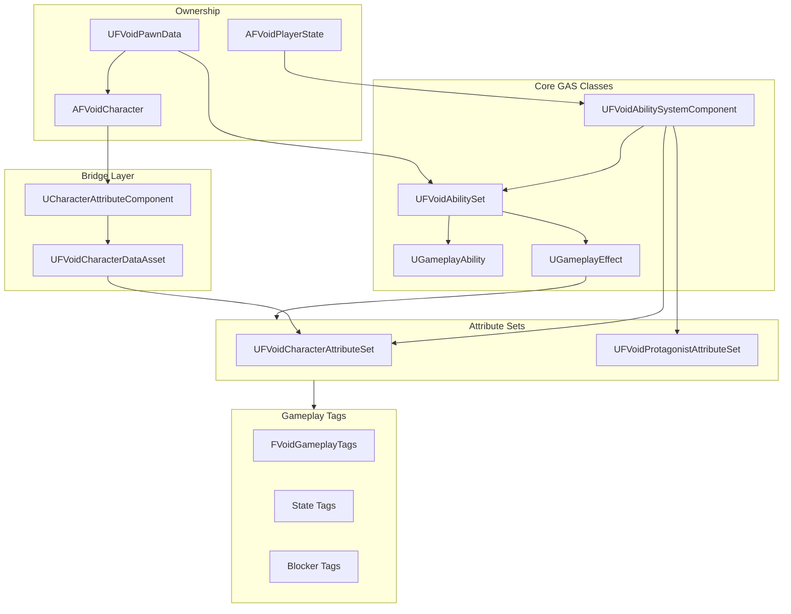

# Ability System Architecture

```mermaid
flowchart TB
subgraph Core["Core GAS Classes"]
	ASC["UFVoidAbilitySystemComponent"]
	AS["UFVoidAbilitySet"]
	GA["UGameplayAbility"]
	GE["UGameplayEffect"]
end
subgraph Attributes["Attribute Sets"]
    CAS["UFVoidCharacterAttributeSet"]
    PAS["UFVoidProtagonistAttributeSet"]
end

subgraph Bridge["Bridge Layer"]
    CAC["UCharacterAttributeComponent"]
    CDA["UFVoidCharacterDataAsset"]
end

subgraph Owner["Ownership"]
    PS["AFVoidPlayerState"]
    CH["AFVoidCharacter"]
    PD["UFVoidPawnData"]
end

subgraph Tags["Gameplay Tags"]
    GT["FVoidGameplayTags"]
    ST["State Tags"]
    BL["Blocker Tags"]
end

PS --> ASC
ASC --> CAS
ASC --> PAS
ASC --> AS
AS --> GA
AS --> GE

CH --> CAC
CAC --> CDA
CDA --> CAS

PD --> AS
PD --> CH

GE --> Attributes
Attributes --> Tags
```