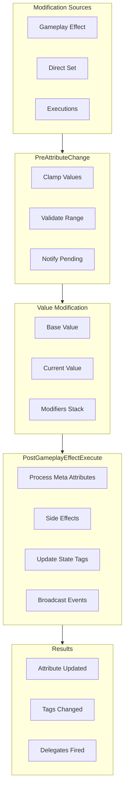
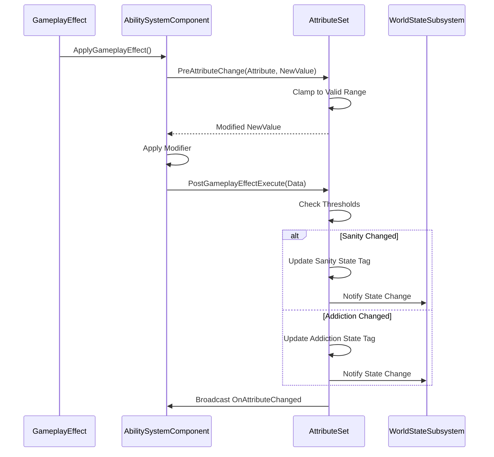

# Attribute Processing Flow

```mermaid
flowchart TB
subgraph Input["Modification Sources"]
	GE["Gameplay Effect"]
	DI["Direct Set"]
	EX["Executions"]
end
subgraph PreChange["PreAttributeChange"]
    CL["Clamp Values"]
    VL["Validate Range"]
    NF["Notify Pending"]
end

subgraph Modification["Value Modification"]
    BS["Base Value"]
    CV["Current Value"]
    MD["Modifiers Stack"]
end

subgraph PostExecute["PostGameplayEffectExecute"]
    MT["Process Meta Attributes"]
    SE["Side Effects"]
    TG["Update State Tags"]
    EV["Broadcast Events"]
end

subgraph Output["Results"]
    AT["Attribute Updated"]
    GT["Tags Changed"]
    DL["Delegates Fired"]
end

Input --> PreChange
PreChange --> Modification
Modification --> PostExecute
PostExecute --> Output
```

## Attribute Modification Detail

```mermaid
sequenceDiagram 
    participant GE as GameplayEffect
    participant ASC as AbilitySystemComponent
    participant AS as AttributeSet
    participant WS as WorldStateSubsystem
GE->>ASC: ApplyGameplayEffect()
ASC->>AS: PreAttributeChange(Attribute, NewValue)
AS->>AS: Clamp to Valid Range
AS-->>ASC: Modified NewValue

ASC->>ASC: Apply Modifier

ASC->>AS: PostGameplayEffectExecute(Data)
AS->>AS: Check Thresholds

alt Sanity Changed
    AS->>AS: Update Sanity State Tag
    AS->>WS: Notify State Change
else Addiction Changed
    AS->>AS: Update Addiction State Tag
    AS->>WS: Notify State Change
end

AS->>ASC: Broadcast OnAttributeChanged
```