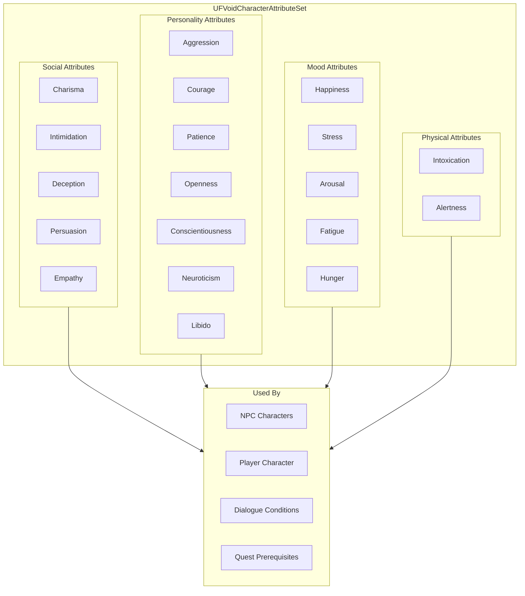
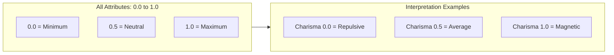

# Character Attribute Set Structure

```mermaid
flowchart TB
subgraph UFVoidCharacterAttributeSet["UFVoidCharacterAttributeSet"]
	subgraph Social["Social Attributes"]
		CH["Charisma"]
		IN["Intimidation"]
		DE["Deception"]
		PE["Persuasion"]
		EM["Empathy"]
	end
	    subgraph Personality["Personality Attributes"]
        AG["Aggression"]
        CO["Courage"]
        PA["Patience"]
        OP["Openness"]
        CN["Conscientiousness"]
        NE["Neuroticism"]
        LI["Libido"]
    end

    subgraph Mood["Mood Attributes"]
        HA["Happiness"]
        ST["Stress"]
        AR["Arousal"]
        FA["Fatigue"]
        HU["Hunger"]
    end

    subgraph Physical["Physical Attributes"]
        IX["Intoxication"]
        AL["Alertness"]
    end
end

subgraph Usage["Used By"]
    NPC["NPC Characters"]
    PLR["Player Character"]
    DLG["Dialogue Conditions"]
    QST["Quest Prerequisites"]
end

Social --> Usage
Personality --> Usage
Mood --> Usage
Physical --> Usage
```

## Attribute Ranges

```mermaid
flowchart LR
subgraph Range["All Attributes: 0.0 to 1.0"]
    MN["0.0 = Minimum"]
    MD["0.5 = Neutral"]
    MX["1.0 = Maximum"]
end
subgraph Examples["Interpretation Examples"]
    E1["Charisma 0.0 = Repulsive"]
    E2["Charisma 0.5 = Average"]
    E3["Charisma 1.0 = Magnetic"]
end

Range --> Examples
```