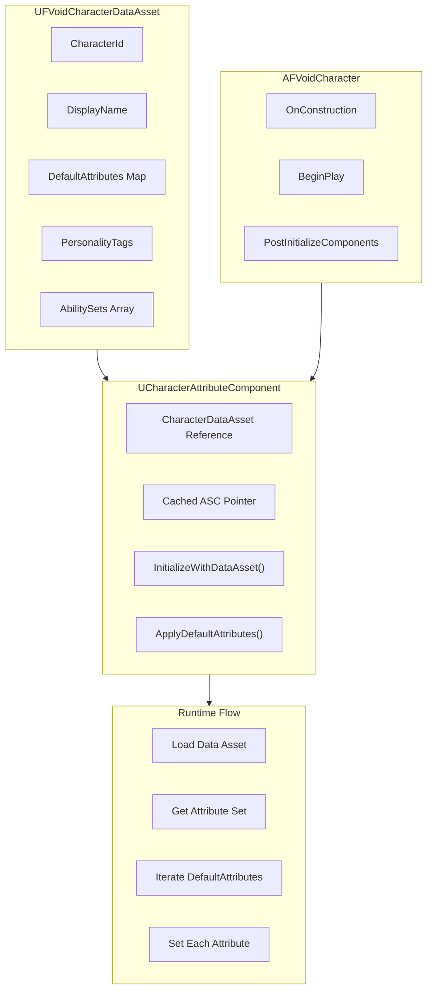
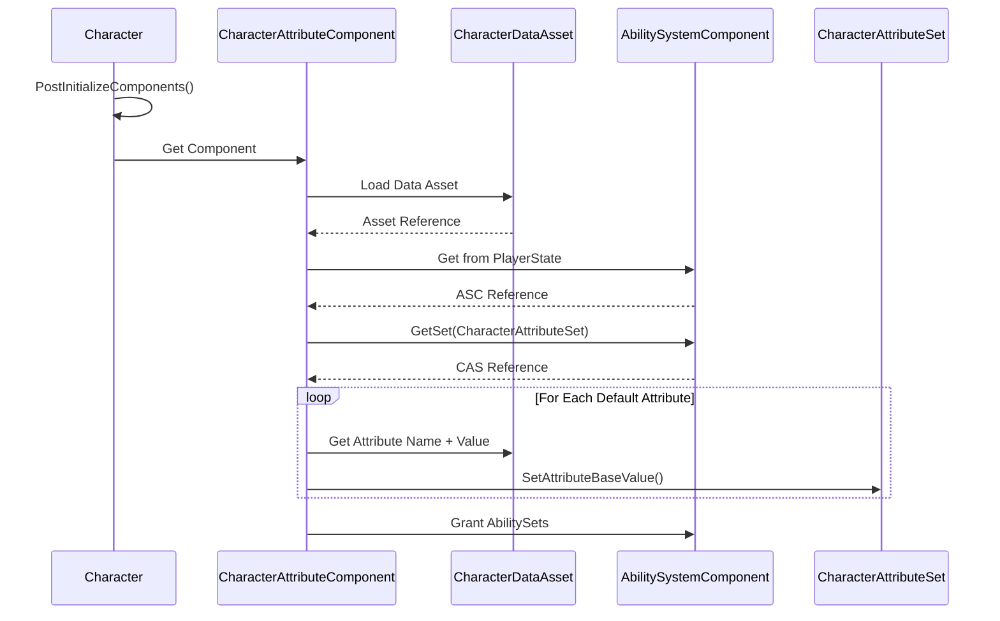

# Character Data Asset Bridge

```mermaid
flowchart TB
subgraph DataAsset["UFVoidCharacterDataAsset"]
	ID["CharacterId"]
	DN["DisplayName"]
	DA["DefaultAttributes Map"]
	PT["PersonalityTags"]
	AB["AbilitySets Array"]
end
subgraph Component["UCharacterAttributeComponent"]
    REF["CharacterDataAsset Reference"]
    ASC["Cached ASC Pointer"]
    INI["InitializeWithDataAsset()"]
    APL["ApplyDefaultAttributes()"]
end

subgraph Runtime["Runtime Flow"]
    LD["Load Data Asset"]
    GT["Get Attribute Set"]
    IT["Iterate DefaultAttributes"]
    ST["Set Each Attribute"]
end

subgraph Character["AFVoidCharacter"]
    OC["OnConstruction"]
    BP["BeginPlay"]
    PS["PostInitializeComponents"]
end

DataAsset --> Component
Component --> Runtime
Character --> Component
```
## Initialization Sequence

```mermaid
sequenceDiagram
    participant CH as Character
    participant CAC as CharacterAttributeComponent
    participant CDA as CharacterDataAsset
    participant ASC as AbilitySystemComponent
    participant CAS as CharacterAttributeSet
    CH->>CH: PostInitializeComponents()
CH->>CAC: Get Component

CAC->>CDA: Load Data Asset
CDA-->>CAC: Asset Reference

CAC->>ASC: Get from PlayerState
ASC-->>CAC: ASC Reference

CAC->>ASC: GetSet(CharacterAttributeSet)
ASC-->>CAC: CAS Reference

loop For Each Default Attribute
    CAC->>CDA: Get Attribute Name + Value
    CAC->>CAS: SetAttributeBaseValue()
end

CAC->>ASC: Grant AbilitySets
```