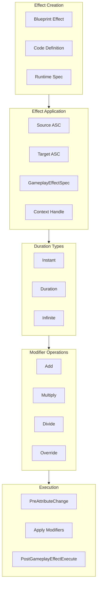
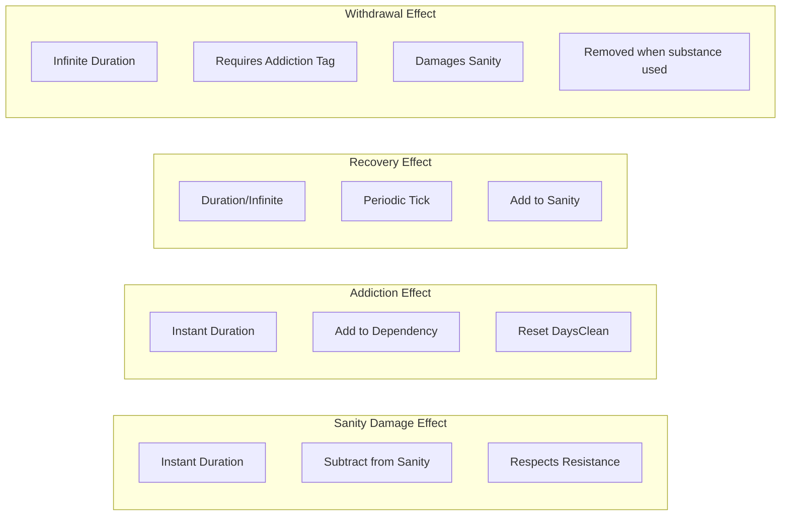
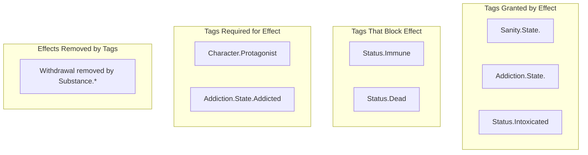

# Gameplay Effects Flow

```mermaid
flowchart TB
subgraph Creation["Effect Creation"]
	BP["Blueprint Effect"]
	CD["Code Definition"]
	RT["Runtime Spec"]
end
subgraph Application["Effect Application"]
    SR["Source ASC"]
    TG["Target ASC"]
    SP["GameplayEffectSpec"]
    CT["Context Handle"]
end

subgraph Duration["Duration Types"]
    IN["Instant"]
    DR["Duration"]
    IF["Infinite"]
end

subgraph Modifiers["Modifier Operations"]
    AD["Add"]
    ML["Multiply"]
    DV["Divide"]
    OV["Override"]
end

subgraph Execution["Execution"]
    PR["PreAttributeChange"]
    AP["Apply Modifiers"]
    PO["PostGameplayEffectExecute"]
end

Creation --> Application
Application --> Duration
Duration --> Modifiers
Modifiers --> Execution
```

## Common Effect Patterns

```mermaid
flowchart LR
subgraph SanityDamage["Sanity Damage Effect"]
    SD1["Instant Duration"]
    SD2["Subtract from Sanity"]
    SD3["Respects Resistance"]
end
subgraph AddictionIncrease["Addiction Effect"]
    AI1["Instant Duration"]
    AI2["Add to Dependency"]
    AI3["Reset DaysClean"]
end

subgraph Recovery["Recovery Effect"]
    RC1["Duration/Infinite"]
    RC2["Periodic Tick"]
    RC3["Add to Sanity"]
end

subgraph Withdrawal["Withdrawal Effect"]
    WD1["Infinite Duration"]
    WD2["Requires Addiction Tag"]
    WD3["Damages Sanity"]
    WD4["Removed when substance used"]
end
```

## Effect Tags

```mermaid
flowchart TB
subgraph GrantedTags["Tags Granted by Effect"]
    G1["Sanity.State."]
    G2["Addiction.State."]
    G3["Status.Intoxicated"]
end
subgraph BlockedTags["Tags That Block Effect"]
    B1["Status.Immune"]
    B2["Status.Dead"]
end

subgraph RequiredTags["Tags Required for Effect"]
    R1["Character.Protagonist"]
    R2["Addiction.State.Addicted"]
end

subgraph RemoveTags["Effects Removed by Tags"]
    X1["Withdrawal removed by Substance.*"]
end
```