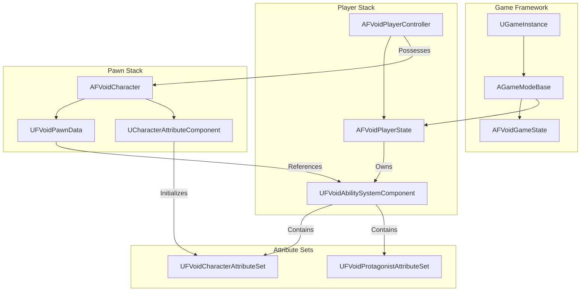
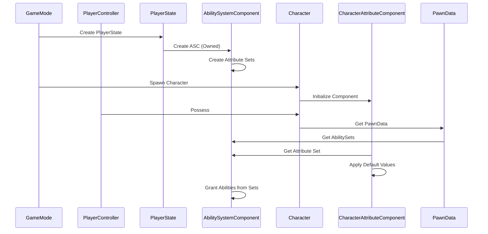

# ASC Ownership Pattern

```mermaid
flowchart TB
subgraph GameFramework["Game Framework"]
	GI["UGameInstance"]
	GM["AGameModeBase"]
	GS["AFVoidGameState"]
end
subgraph PlayerStack["Player Stack"]
    PC["AFVoidPlayerController"]
    PS["AFVoidPlayerState"]
    ASC["UFVoidAbilitySystemComponent"]
end

subgraph PawnStack["Pawn Stack"]
    CH["AFVoidCharacter"]
    PD["UFVoidPawnData"]
    CAC["UCharacterAttributeComponent"]
end

subgraph AttributeSets["Attribute Sets"]
    CAS["UFVoidCharacterAttributeSet"]
    PAS["UFVoidProtagonistAttributeSet"]
end

GI --> GM
GM --> GS
GM --> PS

PC --> PS
PS -->|"Owns"| ASC
PC -->|"Possesses"| CH

CH --> PD
CH --> CAC
PD -->|"References"| ASC

ASC -->|"Contains"| CAS
ASC -->|"Contains"| PAS
CAC -->|"Initializes"| CAS
```

## Initialization Sequence

```mermaid
sequenceDiagram 
    participant GM as GameMode
    participant PC as PlayerController
    participant PS as PlayerState
    participant ASC as AbilitySystemComponent
    participant CH as Character
    participant CAC as CharacterAttributeComponent
    participant PD as PawnData

GM->>PS: Create PlayerState
PS->>ASC: Create ASC (Owned)
ASC->>ASC: Create Attribute Sets

GM->>CH: Spawn Character
CH->>CAC: Initialize Component

PC->>CH: Possess
CH->>PD: Get PawnData
PD->>ASC: Get AbilitySets

CAC->>ASC: Get Attribute Set
CAC->>CAC: Apply Default Values

ASC->>ASC: Grant Abilities from Sets
```