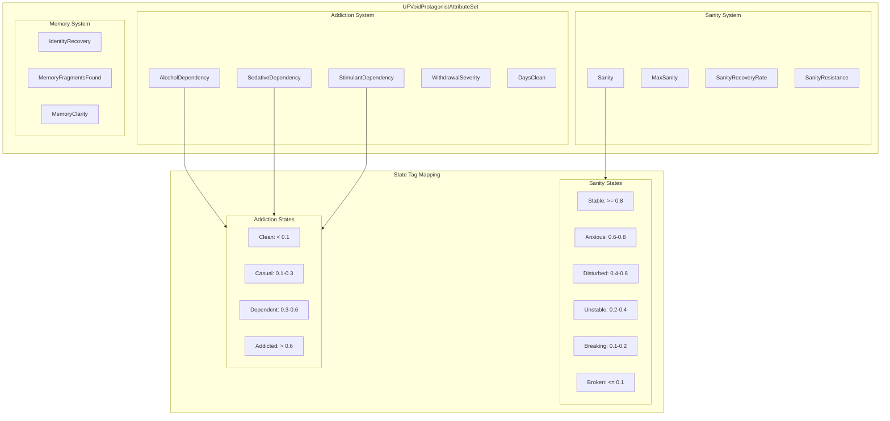
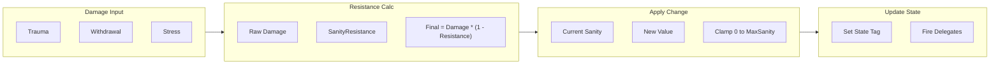

# Protagonist Attribute Set Structure

```mermaid
flowchart TB
subgraph UFVoidProtagonistAttributeSet["UFVoidProtagonistAttributeSet"]
	subgraph Sanity["Sanity System"]
		SAN["Sanity"]
		MAX["MaxSanity"]
		REC["SanityRecoveryRate"]
		RES["SanityResistance"]
	end
	    subgraph Addiction["Addiction System"]
        ALC["AlcoholDependency"]
        SED["SedativeDependency"]
        STM["StimulantDependency"]
        WTH["WithdrawalSeverity"]
        DCL["DaysClean"]
    end

    subgraph Memory["Memory System"]
        IDR["IdentityRecovery"]
        MFF["MemoryFragmentsFound"]
        MCL["MemoryClarity"]
    end
end

subgraph StateMapping["State Tag Mapping"]
    subgraph SanityStates["Sanity States"]
        SS1["Stable: >= 0.8"]
        SS2["Anxious: 0.6-0.8"]
        SS3["Disturbed: 0.4-0.6"]
        SS4["Unstable: 0.2-0.4"]
        SS5["Breaking: 0.1-0.2"]
        SS6["Broken: <= 0.1"]
    end

    subgraph AddictionStates["Addiction States"]
        AS1["Clean: < 0.1"]
        AS2["Casual: 0.1-0.3"]
        AS3["Dependent: 0.3-0.6"]
        AS4["Addicted: > 0.6"]
    end
end

SAN --> SanityStates
ALC --> AddictionStates
SED --> AddictionStates
STM --> AddictionStates
```

## Sanity Processing

```mermaid
flowchart LR
subgraph Damage["Damage Input"]
    TR["Trauma"]
    WD["Withdrawal"]
    ST["Stress"]
end
subgraph Resistance["Resistance Calc"]
    DM["Raw Damage"]
    RS["SanityResistance"]
    FN["Final = Damage * (1 - Resistance)"]
end

subgraph Apply["Apply Change"]
    CV["Current Sanity"]
    NV["New Value"]
    CL["Clamp 0 to MaxSanity"]
end

subgraph Result["Update State"]
    TG["Set State Tag"]
    EV["Fire Delegates"]
end

Damage --> Resistance
Resistance --> Apply
Apply --> Result
```