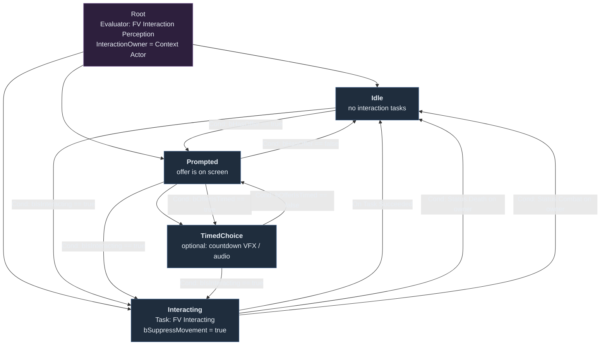
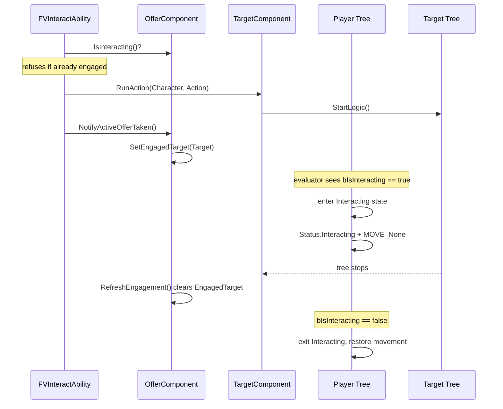

# Player Interaction State Tree

Reference for authoring the player-side State Tree asset (`ST_Player_Interaction`) that
drives the interaction system. Every property named here exists in code — the asset is
purely wiring, no new nodes required.

## Node inventory

| Node | Class | Role |
| --- | --- | --- |
| Evaluator | `UFVInteractionPerceptionEvaluator` | Wraps the instigator + offer components and republishes their state as bindable outputs. |
| Task | `UFVInteractingStateTask` | Owns the player's side of the handshake while the target's tree executes. |

Both take an `InteractionOwner` input that must be bound to the tree's **Context Actor**
(the `APlayerCharacter`). Neither performs detection itself.

## Evaluator outputs

Bind conditions and transitions to these. They are re-sampled every tick.

| Output | Type | Meaning |
| --- | --- | --- |
| `bHasFocus` | `bool` | Instigator has a focused target. |
| `bHasOffer` | `bool` | An offer won arbitration and is being presented. |
| `bIsInteracting` | `bool` | The player committed to a target whose tree is still running. |
| `bOfferIsTimed` | `bool` | Active offer counts down and will auto-resolve. |
| `OfferTimeRemaining` | `float` | Seconds left; `0` when not timed. |
| `FocusedTarget` | `UFVInteractionTargetComponent*` | Currently focused component. |
| `EngagedTarget` | `UFVInteractionTargetComponent*` | Component the player is committed to. |
| `EngagedActor` | `AActor*` | Owner of `EngagedTarget`; convenient for look-at / framing tasks. |

> `bHasFocus` and `bHasOffer` are not redundant. Focus is raw perception; an offer only
> exists once the resolver bound at least one slot **and** requirements passed. A target
> can be focused while offering nothing.

## Tree shape

### Transition conditions in detail

| From | To | Condition node | Bound to |
| --- | --- | --- | --- |
| Idle | Prompted | `Compare Bool` == `true` | `bHasOffer` |
| Prompted | Idle | `Compare Bool` == `false` | `bHasOffer` |
| Prompted | TimedChoice | `Compare Bool` == `true` | `bOfferIsTimed` |
| any | Interacting | `Compare Bool` == `true` | `bIsInteracting` |
| Interacting | Idle | transition on `Succeeded` | task completion |
| Interacting | Idle | `Gameplay Tag Query` | `Status.Death`, `Status.Combat` |

The `bIsInteracting` transition must exist on **every** non-interacting state and should
have the highest priority, since engagement can begin from any of them.

## The handshake

Execution lives on the target, not the player. The player tree only mirrors it.

Two invariants make this safe:

- `NotifyActiveOfferTaken()` only engages if the target's tree actually started, so a
  failed action never strands the player in `Interacting`.
- `UFVInteractingStateTask::ExitState` calls `AbortEngagedInteraction()` if the target is
  still running. A forced transition (death, combat) therefore cannot leave an orphaned
  target tree.

## What the Interacting task does

On enter it sets the loose gameplay tag `Status.Interacting` on the owner's ASC and, when
`bSuppressMovement` is true, calls `StopMovementImmediately()` and parks the character in
`MOVE_None`. It ticks `Running` until the offer component reports disengagement, then
returns `Succeeded`. On exit it clears the tag and restores `MOVE_Walking`.

Gate any ability that should not fire mid-interaction on `Status.Interacting` via its
Activation Blocked Tags. `FVInteractAbility` already refuses in code.

## Cancellation reasons

`ExitState` on target tasks can read `GetCancelReason(OwnerActor)`:

| Reason | Raised by |
| --- | --- |
| `WalkedAway` | offer withdrawn (focus lost) |
| `HigherPriorityOffer` | superseded by a scripted offer |
| `OfferExpired` | timed offer elapsed |
| `CombatStarted` / `Death` | forced transitions |
| `Scripted` | default, incl. player-tree abort |
| `None` | task exited normally |

## Authoring checklist

1. Create `ST_Player_Interaction` with schema **StateTree Component Schema**, context actor `APlayerCharacter`.
2. Add the evaluator at Root; bind `InteractionOwner` to the context actor.
3. Create `Idle`, `Prompted`, `Interacting` states (add `TimedChoice` only if you want countdown feedback).
4. Add `UFVInteractingStateTask` to `Interacting`; bind `InteractionOwner`, leave `bSuppressMovement` true.
5. Wire the transitions from the table above, `bIsInteracting` first.
6. Assign the asset to the player's `StateTreeComponent`.

Note that no state drives the prompt UI — that flows independently through the
offer message → `UFVInteractionUIRouterComponent` → widget pipeline. `Prompted` exists
for gameplay-side reactions (camera, audio, animation), not for showing the prompt.
