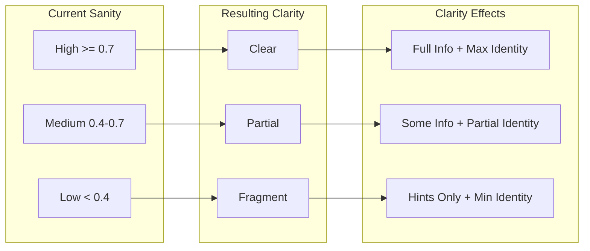

# Story System Flowcharts

## Memory Clarity

```mermaid
flowchart LR
subgraph Sanity["Current Sanity"]
	HS["High >= 0.7"]
	MS["Medium 0.4-0.7"]
	LS["Low < 0.4"]
end
subgraph Clarity["Resulting Clarity"]
    CL["Clear"]
    PA["Partial"]
    FR["Fragment"]
end

subgraph Effects["Clarity Effects"]
    CE_CL["Full Info + Max Identity"]
    CE_PA["Some Info + Partial Identity"]
    CE_FR["Hints Only + Min Identity"]
end

HS --> CL
MS --> PA
LS --> FR

CL --> CE_CL
PA --> CE_PA
FR --> CE_FR
```