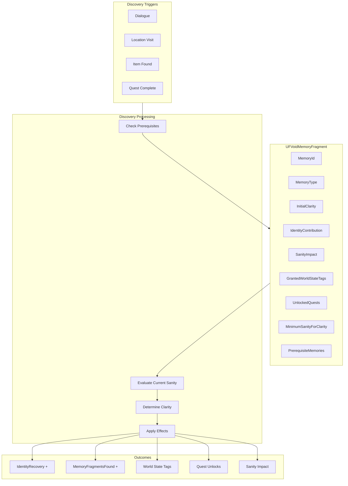

# Story System Flowcharts

## Memory System

```mermaid
flowchart TB
subgraph Discovery["Discovery Triggers"]
	DL["Dialogue"]
	LO["Location Visit"]
	IT["Item Found"]
	QC["Quest Complete"]
end
subgraph Fragment["UFVoidMemoryFragment"]
    MID["MemoryId"]
    MTY["MemoryType"]
    ICL["InitialClarity"]
    IDC["IdentityContribution"]
    SNI["SanityImpact"]
    GWT["GrantedWorldStateTags"]
    UNQ["UnlockedQuests"]
    MSC["MinimumSanityForClarity"]
    PRM["PrerequisiteMemories"]
end

subgraph Processing["Discovery Processing"]
    CHK["Check Prerequisites"]
    EVL["Evaluate Current Sanity"]
    DTC["Determine Clarity"]
    APL["Apply Effects"]
end

subgraph Results["Outcomes"]
    IDR["IdentityRecovery +"]
    MFF["MemoryFragmentsFound +"]
    WST["World State Tags"]
    QUN["Quest Unlocks"]
    SAN["Sanity Impact"]
end

Discovery --> CHK
CHK --> Fragment
Fragment --> EVL
EVL --> DTC
DTC --> APL

APL --> IDR
APL --> MFF
APL --> WST
APL --> QUN
APL --> SAN
```