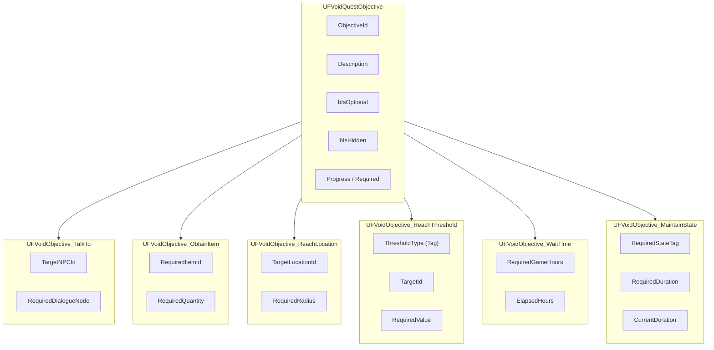

# Story System Flowcharts

## Objective Types

```mermaid
flowchart TB
	subgraph Base["UFVoidQuestObjective"]
		ID["ObjectiveId"]
		DS["Description"]
		OP["bIsOptional"]
		HD["bIsHidden"]
		PR["Progress / Required"]
	end

	subgraph TalkTo["UFVoidObjective_TalkTo"]
    TT_NPC["TargetNPCId"]
    TT_DLG["RequiredDialogueNode"]
    end
    
    subgraph ObtainItem["UFVoidObjective_ObtainItem"]
        OI_ID["RequiredItemId"]
        OI_QT["RequiredQuantity"]
    end
    
    subgraph ReachLocation["UFVoidObjective_ReachLocation"]
        RL_ID["TargetLocationId"]
        RL_RD["RequiredRadius"]
    end
    
    subgraph ReachThreshold["UFVoidObjective_ReachThreshold"]
        RT_TY["ThresholdType (Tag)"]
        RT_TG["TargetId"]
        RT_VL["RequiredValue"]
    end
    
    subgraph WaitTime["UFVoidObjective_WaitTime"]
        WT_HR["RequiredGameHours"]
        WT_EL["ElapsedHours"]
    end
    
    subgraph MaintainState["UFVoidObjective_MaintainState"]
        MS_TG["RequiredStateTag"]
        MS_DR["RequiredDuration"]
        MS_CT["CurrentDuration"]
    end
    
    Base --> TalkTo
    Base --> ObtainItem
    Base --> ReachLocation
    Base --> ReachThreshold
    Base --> WaitTime
    Base --> MaintainState
```