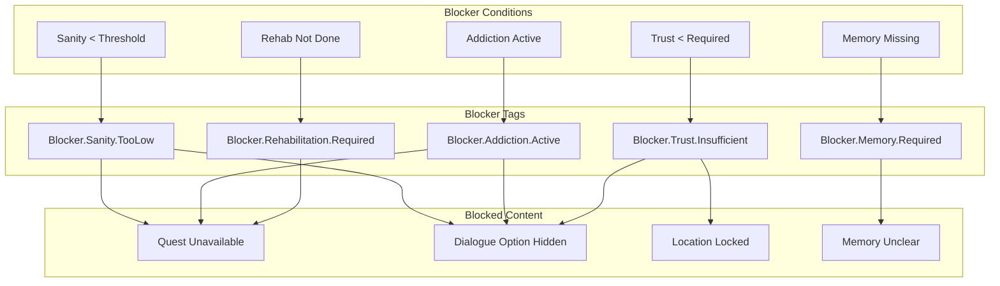

# Story System Flowcharts

## Progression Blockers

```mermaid
flowchart TB
subgraph Conditions["Blocker Conditions"]
	C1["Sanity < Threshold"]
	C2["Addiction Active"]
	C3["Trust < Required"]
	C4["Memory Missing"]
	C5["Rehab Not Done"]
end
subgraph Tags["Blocker Tags"]
    T1["Blocker.Sanity.TooLow"]
    T2["Blocker.Addiction.Active"]
    T3["Blocker.Trust.Insufficient"]
    T4["Blocker.Memory.Required"]
    T5["Blocker.Rehabilitation.Required"]
end

subgraph Effects["Blocked Content"]
    E1["Quest Unavailable"]
    E2["Dialogue Option Hidden"]
    E3["Location Locked"]
    E4["Memory Unclear"]
end

C1 --> T1
C2 --> T2
C3 --> T3
C4 --> T4
C5 --> T5

T1 --> E1
T1 --> E2
T2 --> E1
T2 --> E2
T3 --> E2
T3 --> E3
T4 --> E4
T5 --> E1
```