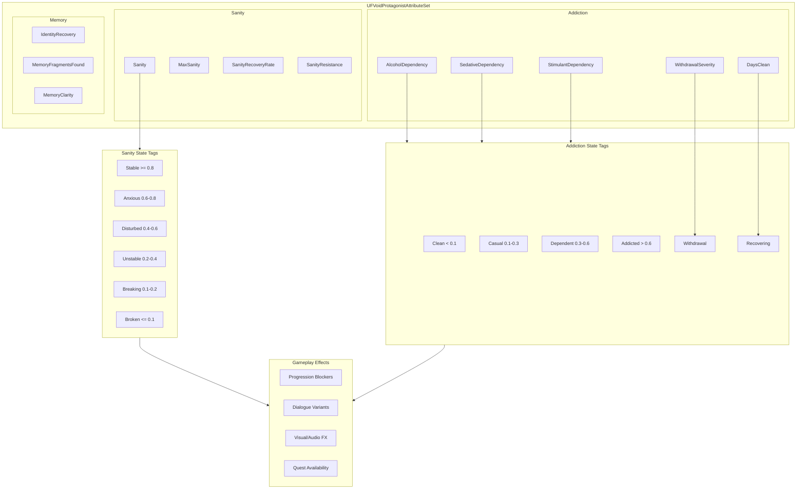

# Story System Flowcharts

## Psychological System

```mermaid
flowchart TB
subgraph Attributes["UFVoidProtagonistAttributeSet"]
	subgraph Sanity["Sanity"]
		SAN["Sanity"]
		MAX["MaxSanity"]
		REC["SanityRecoveryRate"]
		RES["SanityResistance"]
	end
	subgraph Addiction["Addiction"]
        ALC["AlcoholDependency"]
        SED["SedativeDependency"]
        STM["StimulantDependency"]
        WTH["WithdrawalSeverity"]
        DCL["DaysClean"]
    end
    
    subgraph Memory["Memory"]
        IDR["IdentityRecovery"]
        MFF["MemoryFragmentsFound"]
        MCL["MemoryClarity"]
    end
end

subgraph SanityStates["Sanity State Tags"]
    S_ST["Stable >= 0.8"]
    S_AN["Anxious 0.6-0.8"]
    S_DI["Disturbed 0.4-0.6"]
    S_UN["Unstable 0.2-0.4"]
    S_BR["Breaking 0.1-0.2"]
    S_BK["Broken <= 0.1"]
end

subgraph AddictionStates["Addiction State Tags"]
    A_CL["Clean < 0.1"]
    A_CA["Casual 0.1-0.3"]
    A_DP["Dependent 0.3-0.6"]
    A_AD["Addicted > 0.6"]
    A_WD["Withdrawal"]
    A_RC["Recovering"]
end

subgraph Effects["Gameplay Effects"]
    BL["Progression Blockers"]
    DL["Dialogue Variants"]
    VS["Visual/Audio FX"]
    QA["Quest Availability"]
end

SAN --> SanityStates
ALC --> AddictionStates
SED --> AddictionStates
STM --> AddictionStates
WTH --> A_WD
DCL --> A_RC

SanityStates --> Effects
AddictionStates --> Effects
```