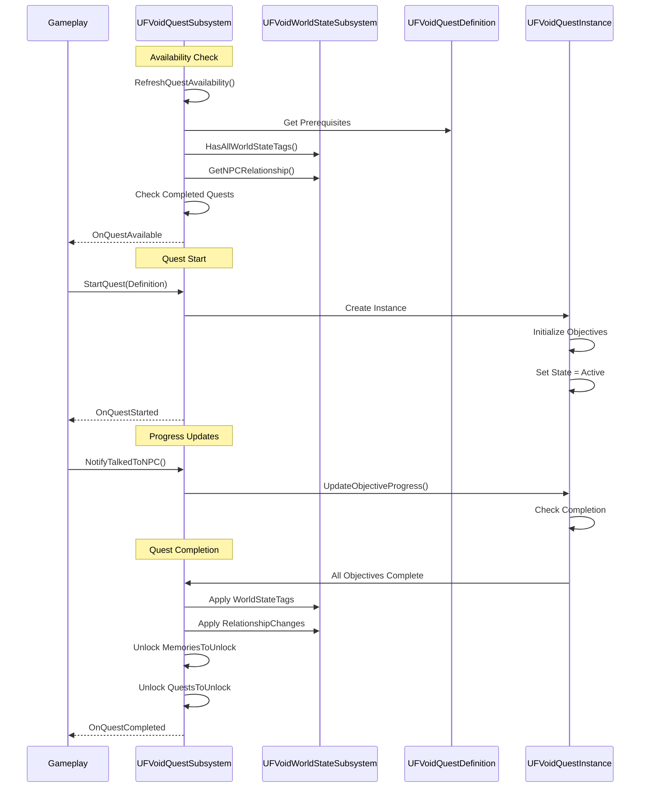

# Story System Flowcharts

## Quest Lifecycle

```mermaid
sequenceDiagram
	participant G as Gameplay
	participant QS as UFVoidQuestSubsystem
	participant WS as UFVoidWorldStateSubsystem
	participant QD as UFVoidQuestDefinition
	participant QI as UFVoidQuestInstance

	Note over QS: Availability Check
	QS->>QS: RefreshQuestAvailability()
	QS->>QD: Get Prerequisites
	QS->>WS: HasAllWorldStateTags()
	QS->>WS: GetNPCRelationship()
	QS->>QS: Check Completed Quests
	QS-->>G: OnQuestAvailable
	
	Note over QS: Quest Start
	G->>QS: StartQuest(Definition)
	QS->>QI: Create Instance
	QI->>QI: Initialize Objectives
	QI->>QI: Set State = Active
	QS-->>G: OnQuestStarted
	
	Note over QS: Progress Updates
	G->>QS: NotifyTalkedToNPC()
	QS->>QI: UpdateObjectiveProgress()
	QI->>QI: Check Completion
	
	Note over QS: Quest Completion
	QI->>QS: All Objectives Complete
	QS->>WS: Apply WorldStateTags
	QS->>WS: Apply RelationshipChanges
	QS->>QS: Unlock MemoriesToUnlock
	QS->>QS: Unlock QuestsToUnlock
	QS-->>G: OnQuestCompleted
```