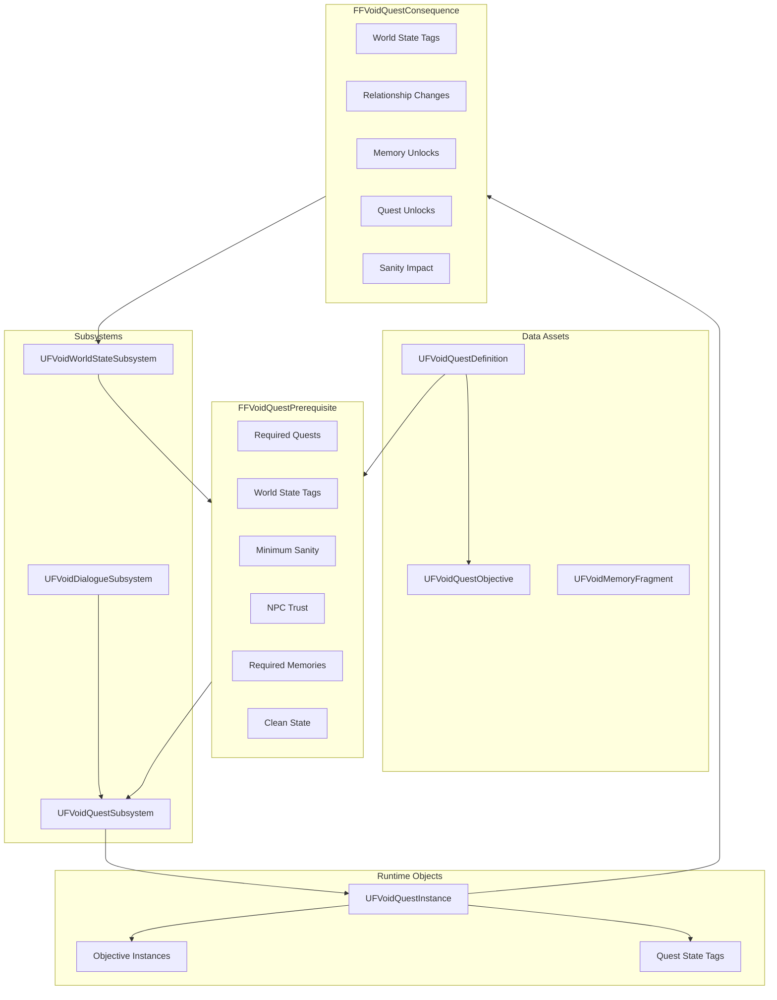

# Story System Flowcharts

## Quest System Architecture

```mermaid
flowchart TB
    subgraph DataAssets["Data Assets"]
        QD["UFVoidQuestDefinition"]
        OB["UFVoidQuestObjective"]
        MF["UFVoidMemoryFragment"]
    end

	subgraph Prerequisites["FFVoidQuestPrerequisite"]
    RQ["Required Quests"]
    WT["World State Tags"]
    MS["Minimum Sanity"]
    NT["NPC Trust"]
    RM["Required Memories"]
    CS["Clean State"]
end

subgraph Runtime["Runtime Objects"]
    QI["UFVoidQuestInstance"]
    OI["Objective Instances"]
    ST["Quest State Tags"]
end

subgraph Subsystems["Subsystems"]
    QS["UFVoidQuestSubsystem"]
    WS["UFVoidWorldStateSubsystem"]
    DS["UFVoidDialogueSubsystem"]
end

subgraph Consequences["FFVoidQuestConsequence"]
    CW["World State Tags"]
    CR["Relationship Changes"]
    CM["Memory Unlocks"]
    CQ["Quest Unlocks"]
    CS2["Sanity Impact"]
end

QD --> Prerequisites
QD --> OB

Prerequisites --> QS
QS --> QI
QI --> OI
QI --> ST

WS --> Prerequisites

QI --> Consequences
Consequences --> WS

DS --> QS
```