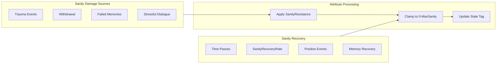

# Story System Flowcharts

## Sanity Flow

```mermaid
flowchart LR
subgraph Damage["Sanity Damage Sources"]
	TR["Trauma Events"]
    WD["Withdrawal"]
	FM["Failed Memories"]
	ST["Stressful Dialogue"]
end
subgraph Processing["Attribute Processing"]
    RS["Apply SanityResistance"]
    CL["Clamp to 0-MaxSanity"]
    TG["Update State Tag"]
end

subgraph Recovery["Sanity Recovery"]
    TM["Time Passes"]
    RR["SanityRecoveryRate"]
    PS["Positive Events"]
    MR["Memory Recovery"]
end

Damage --> RS
RS --> CL
CL --> TG

Recovery --> CL
```