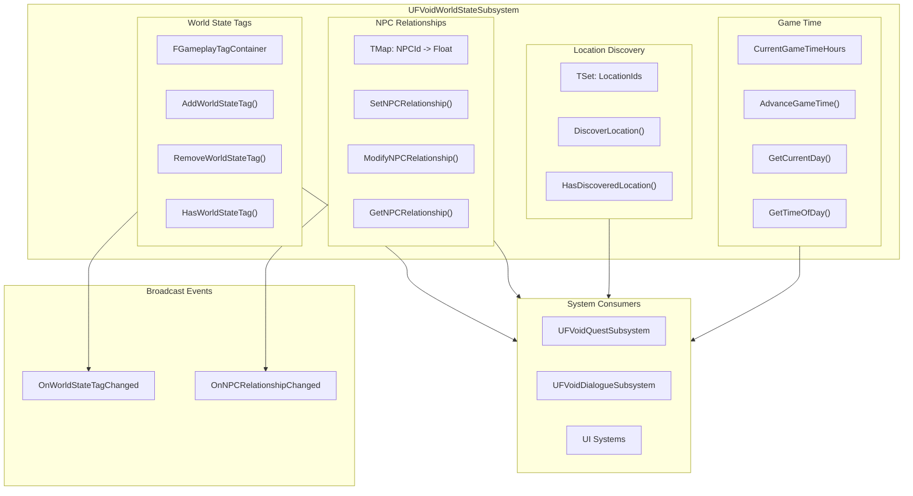

# Story System Flowcharts

## World State System

```mermaid
flowchart TB
subgraph UFVoidWorldStateSubsystem["UFVoidWorldStateSubsystem"]
	subgraph Tags["World State Tags"]
		WT["FGameplayTagContainer"]
		AT["AddWorldStateTag()"]
		RT["RemoveWorldStateTag()"]
		HT["HasWorldStateTag()"]
	end
	subgraph Relationships["NPC Relationships"]
        NR["TMap: NPCId -> Float"]
        SR["SetNPCRelationship()"]
        MR["ModifyNPCRelationship()"]
        GR["GetNPCRelationship()"]
    end
    
    subgraph Locations["Location Discovery"]
        DL["TSet: LocationIds"]
        DI["DiscoverLocation()"]
        HD["HasDiscoveredLocation()"]
    end
    
    subgraph Time["Game Time"]
        CT["CurrentGameTimeHours"]
        AD["AdvanceGameTime()"]
        GD["GetCurrentDay()"]
        GT["GetTimeOfDay()"]
    end
end

subgraph Consumers["System Consumers"]
    QS["UFVoidQuestSubsystem"]
    DS["UFVoidDialogueSubsystem"]
    UI["UI Systems"]
end

subgraph Events["Broadcast Events"]
    E1["OnWorldStateTagChanged"]
    E2["OnNPCRelationshipChanged"]
end

Tags --> Consumers
Relationships --> Consumers
Locations --> Consumers
Time --> Consumers

Tags --> E1
Relationships --> E2
```