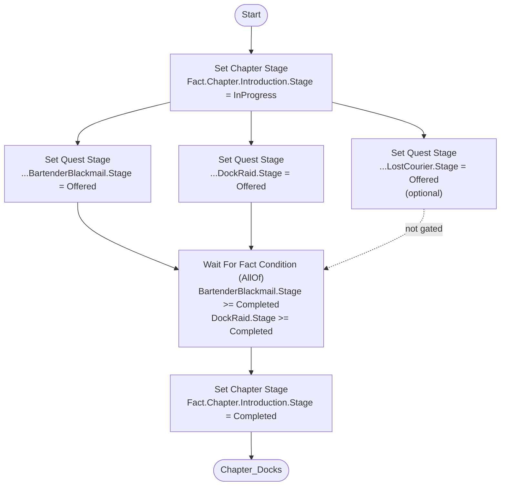
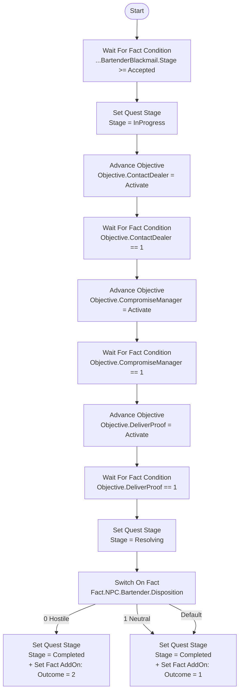
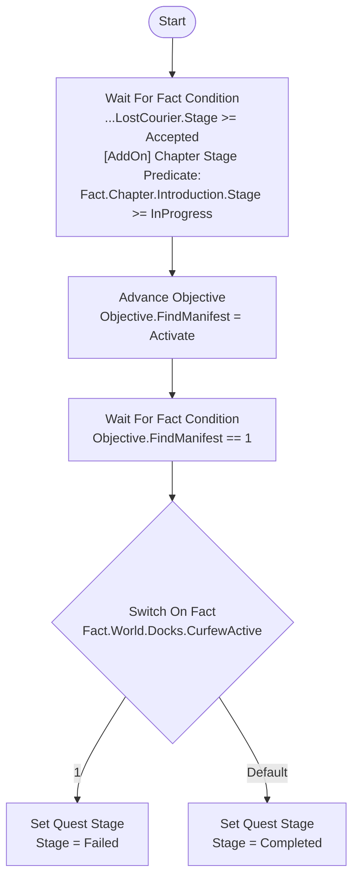

# Quest & Chapter Flow Authoring

How chapters, quests and objectives are expressed as facts, and how the Flow nodes in this
folder read and write them.

## Fact layout

```
Fact.Chapter.<ChapterId>.Stage                            EFVQuestStage
Fact.Chapter.<ChapterId>.Outcome                          designer defined outcome id
Fact.Quest.<ChapterId>.<QuestId>.Stage                    EFVQuestStage
Fact.Quest.<ChapterId>.<QuestId>.Outcome                  designer defined outcome id
Fact.Quest.<ChapterId>.<QuestId>.Objective.<ObjectiveId>  undefined = not issued, 0 = active, 1 = done
Fact.Quest.<ChapterId>.<QuestId>.Counter.<CounterId>      arbitrary tally
```

Three states matter and they are not the same thing:

| State | Meaning |
| --- | --- |
| undefined | never happened / never issued |
| defined, value 0 | explicitly happened, with value zero |
| defined, value N | data |

Because quests nest under their chapter, a single `UndefineFactsUnderTag` call resets either
scope: `Fact.Quest.Introduction` wipes the whole chapter, `Fact.Quest.Introduction.BartenderBlackmail`
wipes one quest.

`EFVQuestStage` values are sparse and ordered — `Inactive 0`, `Offered 10`, `Accepted 20`,
`InProgress 30`, `Resolving 50`, `Failed 90`, `Completed 100` — so `Stage >= Accepted` means
"at least got this far" and new stages can be inserted without renumbering saves. `Failed` and
`Completed` are mutually exclusive terminals, which is why failure is a stage and not its own fact.

Every chapter owns one tag manifest under `Config/Tags/Facts/Quests/<ChapterId>.ini` holding the
chapter's own facts plus every quest in it.

## Requiredness is not a fact

Whether a quest gates chapter progression is authored data, declared by the chapter graph's
**Wait For Fact Condition** `AllOf` group. Optional quests are simply absent from that list.
Storing requiredness as a fact would create a value that must never be written at runtime with
nothing enforcing it.

## Node catalogue

| Node | Kind | Property | Picker filter | Writes / reads |
| --- | --- | --- | --- | --- |
| Set Chapter Stage | node | `ChapterStage` | `Fact.Chapter` | writes `Fact.Chapter.<C>.Stage` |
| Set Quest Stage | node | `QuestStage` | `Fact.Quest` | writes `Fact.Quest.<C>.<Q>.Stage` |
| Advance Objective | node | `Objective` | `Fact.Quest` | writes `...Objective.<Id>` to 0 or 1 |
| Wait For Fact Condition | node | `Conditions` | `Fact` | latent; checks current state, then subscribes |
| Switch On Fact | node | `Fact`, `Values` | `Fact` | routes on the int value |
| Fact Branch | node | `Fact` | `Fact` | immediate two-way branch |
| Chapter Stage Predicate | AddOn | `ChapterStage` | `Fact.Chapter` | gates its parent node |
| Quest Stage Predicate | AddOn | `QuestStage` | `Fact.Quest` | gates its parent node |
| Set Fact | AddOn | `Fact` | `Fact` | writes when its parent executes |

All of these accept predicate AddOns and the **Set Fact** AddOn as children.

`meta=(Categories=)` is only a subtree filter — it cannot express "leaves named Stage". The
pickers therefore still show intermediate tags, and the nodes validate the exact shape
(4 parts for a chapter stage, 5 for a quest stage, 6 for an objective). A wrong-shaped tag is
reported live in the node title/description and again as a compile error.

**Switch On Fact** can label its value pins from an enum: tick `Use Enum For Display` and pick
`EFVQuestStage`. Pin identity stays numeric, so renaming an enumerator never breaks a wire.

## Example: two chapters, required and optional quests

### Chapter graph — `Chapter_Introduction.flow`

The chapter offers its quests, then waits on the required ones only.



`LostCourier` is optional purely because it is missing from the `AllOf` group. It still runs,
still writes its facts, and later content can read them.

### Quest graph — required, `Quest_BartenderBlackmail.flow`



The outcome is written by a **Set Fact** AddOn attached to the same node that sets the stage, so
stage and outcome can never drift apart.

### Quest graph — optional, `Quest_LostCourier.flow`

Optional quests are structurally identical; they just are not referenced by the chapter gate,
and they may gate themselves on chapter progress instead.



### Chaining chapters


A later chapter reads the earlier chapter's quest facts through predicate AddOns, which is why
quest facts are never cleared on chapter completion — only on an explicit reset.

## Who writes what

Graphs are not the only writer. Facts are the shared surface between systems.

| Fact | Written by | Read by |
| --- | --- | --- |
| `Fact.Chapter.<C>.Stage` | chapter graph only | quest graphs, save/load, debug tooling |
| `Fact.Quest.<C>.<Q>.Stage` | that quest's graph and the chapter graph offering it | chapter gate, later chapters, dialogue conditions |
| `Fact.Quest.<C>.<Q>.Objective.<O>` | quest graph (issue) and gameplay/world systems (complete) | quest graph, HUD/journal |
| `Fact.Quest.<C>.<Q>.Counter.<Id>` | gameplay systems (kills, pickups) | quest graph conditions |
| `Fact.Dialogue.*` | dialogue system | quest graphs, dialogue availability |
| `Fact.NPC.*` | dialogue and AI systems | quest outcome branches |
| `Fact.World.*` | world/level scripting | quest and chapter gating |
| `Fact.Player.*` | gameplay systems | anything |

Only `Fact.Quest.*` and `Fact.Chapter.*` are cleared by a quest or chapter reset. The other
trees are world state and survive.

## Authoring checklist

1. Add the chapter and every quest tag to `Config/Tags/Facts/Quests/<ChapterId>.ini` first —
   the nodes only accept tags that already exist.
2. Write the chapter graph, gating on the required quests only.
3. Write each quest graph; drive progress with Advance Objective, never with raw Change Fact.
4. Attach Set Fact AddOns for outcomes rather than adding another node in sequence.
5. Compile the graph — shape errors on stage and objective tags surface there.
