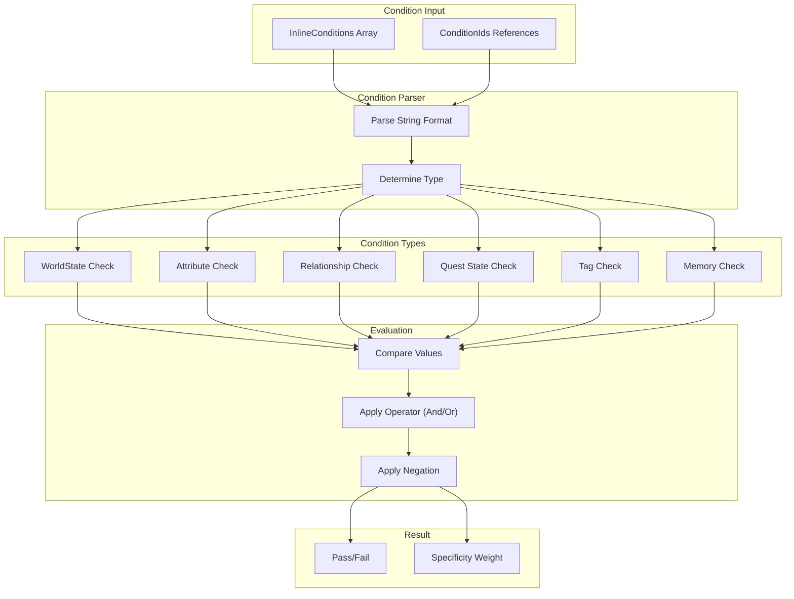

# Dialogue System Flowcharts

## Condition Evaluation

```mermaid
flowchart TB
    subgraph Input["Condition Input"]
        IL["InlineConditions Array"]
        CR["ConditionIds References"]
    end
    subgraph Parser["Condition Parser"]
    PS["Parse String Format"]
    TY["Determine Type"]
end

subgraph Types["Condition Types"]
    WS["WorldState Check"]
    AT["Attribute Check"]
    RL["Relationship Check"]
    QU["Quest State Check"]
    TG["Tag Check"]
    ME["Memory Check"]
end

subgraph Evaluation["Evaluation"]
    CMP["Compare Values"]
    OP["Apply Operator (And/Or)"]
    NG["Apply Negation"]
end

subgraph Output["Result"]
    RS["Pass/Fail"]
    WT["Specificity Weight"]
end

IL --> PS
CR --> PS
PS --> TY

TY --> WS
TY --> AT
TY --> RL
TY --> QU
TY --> TG
TY --> ME

WS --> CMP
AT --> CMP
RL --> CMP
QU --> CMP
TG --> CMP
ME --> CMP

CMP --> OP
OP --> NG
NG --> RS
NG --> WT
```