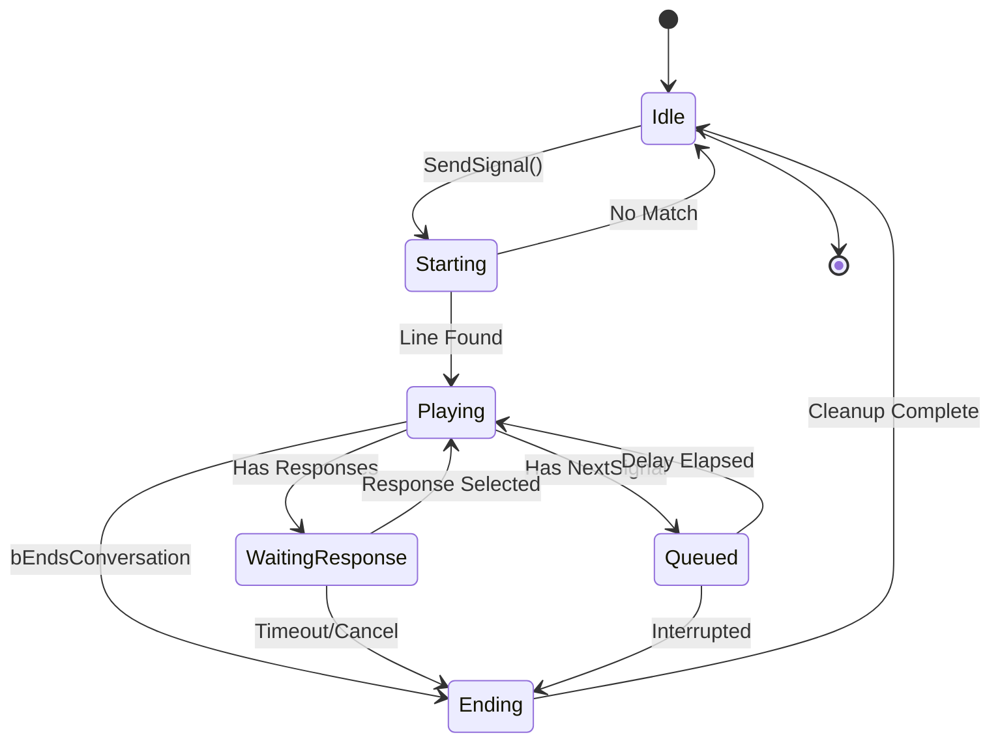

# Dialogue System Flowcharts

## Conversation State Machine

```mermaid
stateDiagram-v2
    [*] --> Idle

    Idle --> Starting: SendSignal()
    Starting --> Playing: Line Found
    Starting --> Idle: No Match
    
    Playing --> WaitingResponse: Has Responses
    Playing --> Queued: Has NextSignal
    Playing --> Ending: bEndsConversation
    
    WaitingResponse --> Playing: Response Selected
    WaitingResponse --> Ending: Timeout/Cancel
    
    Queued --> Playing: Delay Elapsed
    Queued --> Ending: Interrupted
    
    Ending --> Idle: Cleanup Complete
    
    Idle --> [*]
```