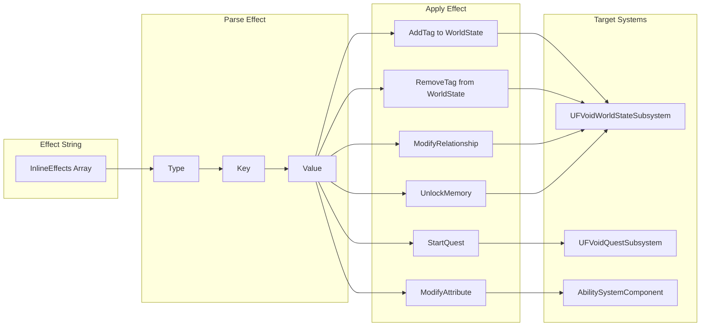

# Dialogue System Flowcharts

## Effect Application

```mermaid
flowchart LR
    subgraph Input["Effect String"]
        EF["InlineEffects Array"]
    end
    subgraph Parse["Parse Effect"]
    TP["Type"]
    KY["Key"]
    VL["Value"]
end

subgraph Apply["Apply Effect"]
    AT["AddTag to WorldState"]
    RT["RemoveTag from WorldState"]
    MR["ModifyRelationship"]
    MA["ModifyAttribute"]
    SQ["StartQuest"]
    UL["UnlockMemory"]
end

subgraph Systems["Target Systems"]
    WS["UFVoidWorldStateSubsystem"]
    QS["UFVoidQuestSubsystem"]
    AS["AbilitySystemComponent"]
end

EF --> TP
TP --> KY
KY --> VL

VL --> AT
VL --> RT
VL --> MR
VL --> MA
VL --> SQ
VL --> UL

AT --> WS
RT --> WS
MR --> WS
MA --> AS
SQ --> QS
UL --> WS
```