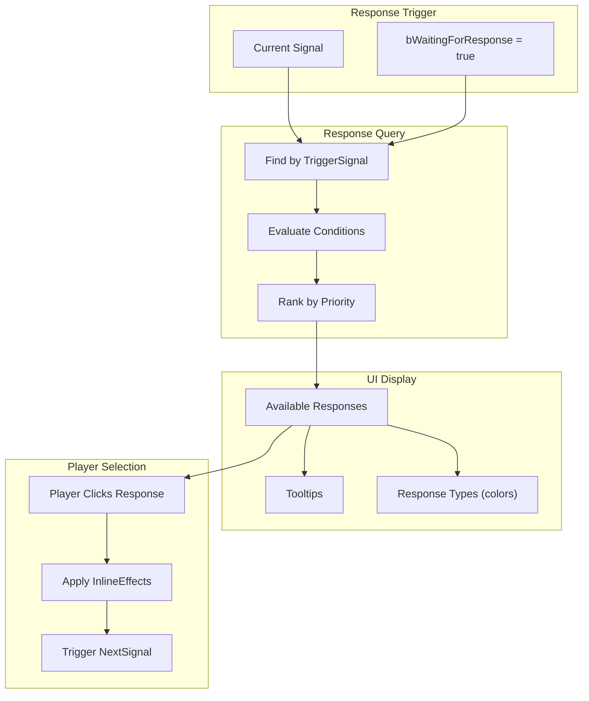

# Dialogue System Flowcharts

## Response Selection

```mermaid
flowchart TB
    subgraph Trigger["Response Trigger"]
        SG["Current Signal"]
        WR["bWaitingForResponse = true"]
    end
    subgraph Query["Response Query"]
    FD["Find by TriggerSignal"]
    EV["Evaluate Conditions"]
    RK["Rank by Priority"]
end

subgraph Display["UI Display"]
    AV["Available Responses"]
    TT["Tooltips"]
    TP["Response Types (colors)"]
end

subgraph Selection["Player Selection"]
    CL["Player Clicks Response"]
    EF["Apply InlineEffects"]
    NX["Trigger NextSignal"]
end

SG --> FD
WR --> FD
FD --> EV
EV --> RK
RK --> AV

AV --> TT
AV --> TP

AV --> CL
CL --> EF
EF --> NX
```