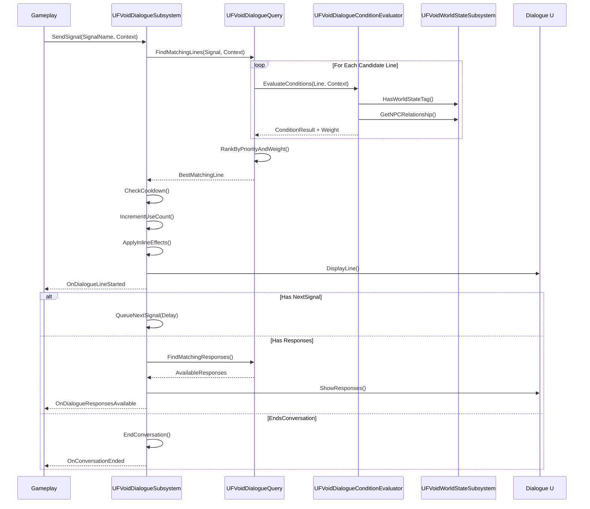

# Dialogue System Flowcharts

## Signal Flow

```mermaid
sequenceDiagram 
    participant G as Gameplay
    participant DS as UFVoidDialogueSubsystem
    participant DQ as UFVoidDialogueQuery
    participant CE as UFVoidDialogueConditionEvaluator
    participant WS as UFVoidWorldStateSubsystem
    participant UI as Dialogue U
    G->>DS: SendSignal(SignalName, Context)
DS->>DQ: FindMatchingLines(Signal, Context)

loop For Each Candidate Line
    DQ->>CE: EvaluateConditions(Line, Context)
    CE->>WS: HasWorldStateTag()
    CE->>WS: GetNPCRelationship()
    CE-->>DQ: ConditionResult + Weight
end

DQ->>DQ: RankByPriorityAndWeight()
DQ-->>DS: BestMatchingLine

DS->>DS: CheckCooldown()
DS->>DS: IncrementUseCount()
DS->>DS: ApplyInlineEffects()
DS->>UI: DisplayLine()
DS-->>G: OnDialogueLineStarted

alt Has NextSignal
    DS->>DS: QueueNextSignal(Delay)
else Has Responses
    DS->>DQ: FindMatchingResponses()
    DQ-->>DS: AvailableResponses
    DS->>UI: ShowResponses()
    DS-->>G: OnDialogueResponsesAvailable
else EndsConversation
    DS->>DS: EndConversation()
    DS-->>G: OnConversationEnded
end
```