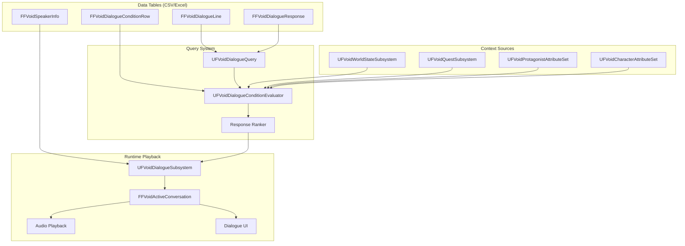

# Dialogue System Flowcharts

## System Architecture

```mermaid
flowchart TB
	subgraph DataTables["Data Tables (CSV/Excel)"]
		DL["FFVoidDialogueLine"]
		DR["FFVoidDialogueResponse"]
		CT["FFVoidDialogueConditionRow"]
		ST["FFVoidSpeakerInfo"]
	end
	subgraph Query["Query System"]
    DQ["UFVoidDialogueQuery"]
    CE["UFVoidDialogueConditionEvaluator"]
    RK["Response Ranker"]
end

subgraph Runtime["Runtime Playback"]
    DS["UFVoidDialogueSubsystem"]
    AC["FFVoidActiveConversation"]
    AU["Audio Playback"]
    UI["Dialogue UI"]
end

subgraph Context["Context Sources"]
    WS["UFVoidWorldStateSubsystem"]
    QS["UFVoidQuestSubsystem"]
    PA["UFVoidProtagonistAttributeSet"]
    CA["UFVoidCharacterAttributeSet"]
end

DL --> DQ
DR --> DQ
CT --> CE
ST --> DS

DQ --> CE
CE --> RK
RK --> DS

DS --> AC
AC --> AU
AC --> UI

WS --> CE
QS --> CE
PA --> CE
CA --> CE
```