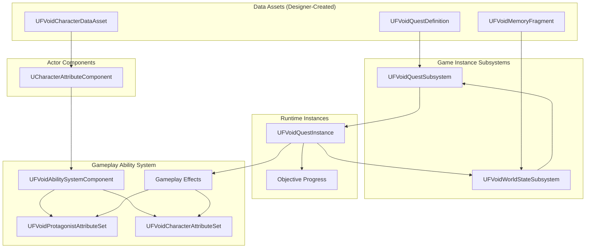

```mermaid
flowchart TB
    subgraph DataAssets["Data Assets (Designer-Created)"]
        QD["UFVoidQuestDefinition"]
        MF["UFVoidMemoryFragment"]
        CD["UFVoidCharacterDataAsset"]
    end

    subgraph Subsystems["Game Instance Subsystems"]
        QS["UFVoidQuestSubsystem"]
        WS["UFVoidWorldStateSubsystem"]
    end

    subgraph Runtime["Runtime Instances"]
        QI["UFVoidQuestInstance"]
        OBJ["Objective Progress"]
    end

    subgraph GAS["Gameplay Ability System"]
        ASC["UFVoidAbilitySystemComponent"]
        PAS["UFVoidProtagonistAttributeSet"]
        CAS["UFVoidCharacterAttributeSet"]
        GE["Gameplay Effects"]
    end

    subgraph Components["Actor Components"]
        CAC["UCharacterAttributeComponent"]
    end

    QD --> QS
    QS --> QI
    QI --> OBJ
    
    WS --> QS
    QI --> WS
    
    MF --> WS
    
    CD --> CAC
    CAC --> ASC
    
    ASC --> PAS
    ASC --> CAS
    
    GE --> PAS
    GE --> CAS
    
    QI --> GE
```