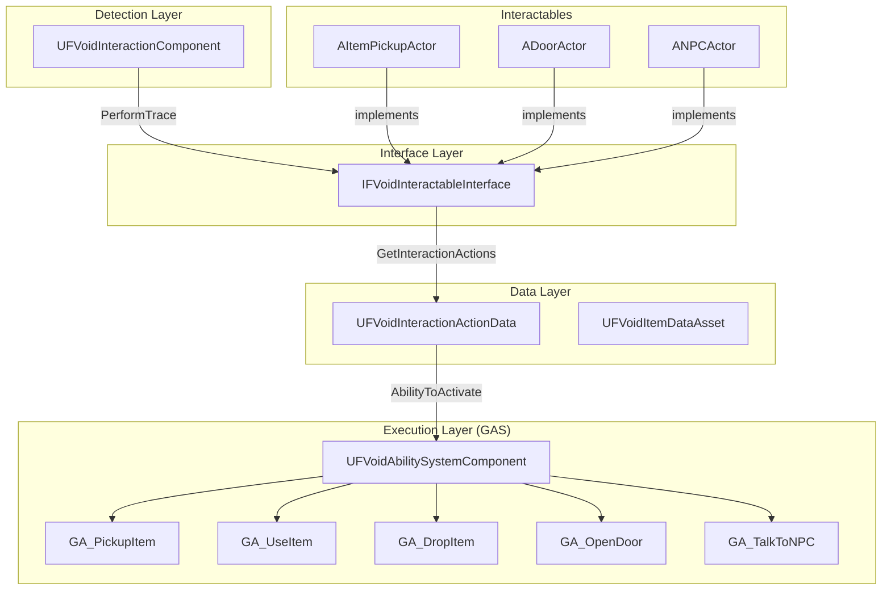

```mermaid
flowchart TB
    subgraph "Detection Layer"
        IC[UFVoidInteractionComponent]
    end
    
    subgraph "Interface Layer"
        II[IFVoidInteractableInterface]
    end
    
    subgraph "Data Layer"
        IAD[UFVoidInteractionActionData]
        IDA[UFVoidItemDataAsset]
    end
    
    subgraph "Execution Layer (GAS)"
        ASC[UFVoidAbilitySystemComponent]
        GA_Pickup[GA_PickupItem]
        GA_Use[GA_UseItem]
        GA_Drop[GA_DropItem]
        GA_Open[GA_OpenDoor]
        GA_Talk[GA_TalkToNPC]
    end
    
    subgraph "Interactables"
        IPA[AItemPickupActor]
        Door[ADoorActor]
        NPC[ANPCActor]
    end
    
    IC -->|"PerformTrace"| II
    IPA -->|"implements"| II
    Door -->|"implements"| II
    NPC -->|"implements"| II
    II -->|"GetInteractionActions"| IAD
    IAD -->|"AbilityToActivate"| ASC
    ASC --> GA_Pickup & GA_Use & GA_Drop & GA_Open & GA_Talk
```