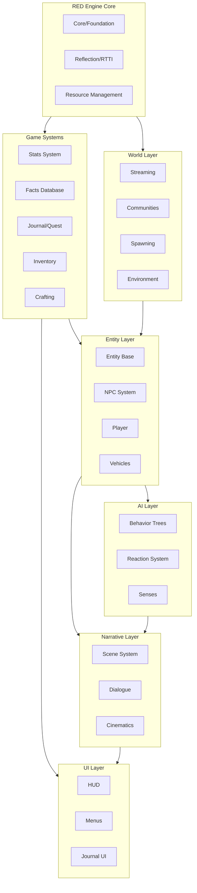

### CD Projekt RED

Based on GDC talks and technical analysis:

Key Patterns from CDPR:
- **Facts Database**: Central truth store for world state (similar to your WorldState)
- **Stats System**: Separate from entities, pure data processing
- **Scene System**: Orchestrates dialogue, animations, cameras independently
- **Communities**: NPC scheduling/behavior separate from individual AI

