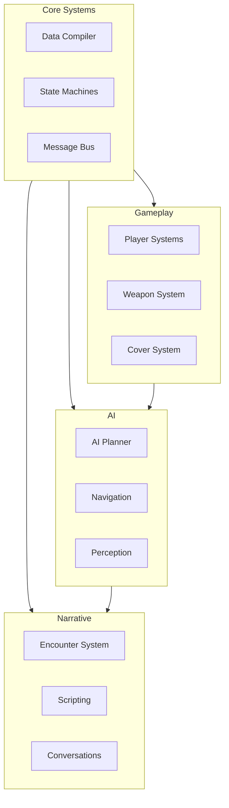

### Naughty Dog (Last of Us, Uncharted)

Key Patterns from Naughty Dog:
- **Encounter System**: Self-contained gameplay segments
- **Message Bus**: Decoupled communication between systems
- **State Machines**: Central to all behavior, not just AI

