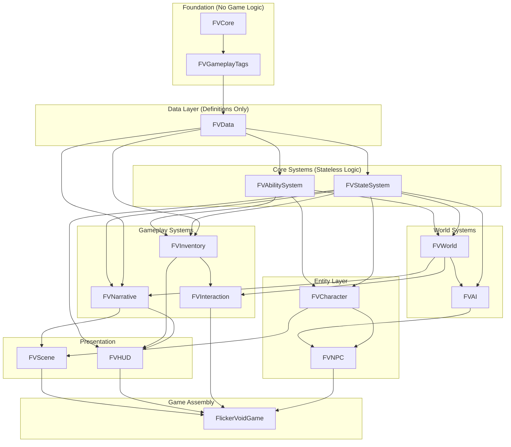

```mermaid
flowchart TD
subgraph Foundation["Foundation (No Game Logic)"]
	CORE[FVCore]
	TAGS[FVGameplayTags]
end
subgraph DataLayer["Data Layer (Definitions Only)"]
    DATA[FVData]
end

subgraph Systems["Core Systems (Stateless Logic)"]
    ABI[FVAbilitySystem]
    STATE[FVStateSystem]
end

subgraph World["World Systems"]
    WLD[FVWorld]
    AI[FVAI]
end

subgraph Gameplay["Gameplay Systems"]
    INV[FVInventory]
    NAR[FVNarrative]
    INTERACT[FVInteraction]
end

subgraph Entities["Entity Layer"]
    CHR[FVCharacter]
    NPC[FVNPC]
end

subgraph Presentation["Presentation"]
    HUD[FVHUD]
    SCENE[FVScene]
end

subgraph Game["Game Assembly"]
    GAME[FlickerVoidGame]
end

CORE --> TAGS
TAGS --> DATA

DATA --> ABI
DATA --> STATE

ABI --> WLD
STATE --> WLD

ABI --> INV
STATE --> INV
DATA --> INV

WLD --> NAR
STATE --> NAR
DATA --> NAR

WLD --> AI
STATE --> AI

ABI --> CHR
STATE --> CHR

AI --> NPC
CHR --> NPC

WLD --> INTERACT
INV --> INTERACT

NAR --> SCENE
CHR --> SCENE

STATE --> HUD
INV --> HUD
NAR --> HUD

SCENE --> GAME
HUD --> GAME
INTERACT --> GAME
NPC --> GAME

```